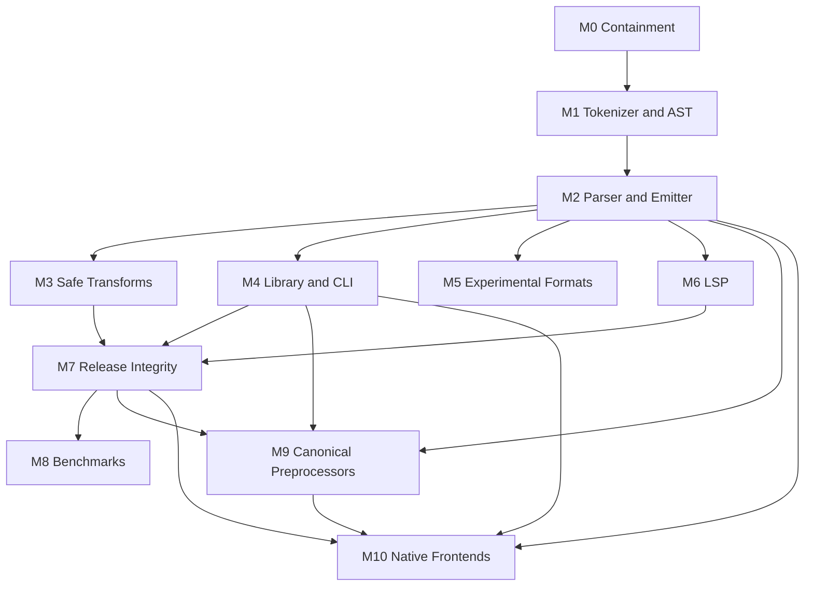

# ZigCSS Development Plan

Status: Approved; stable product verified; `BENCH-007` blocked on a registered bare-metal runner and controlled archive
Plan version: 1.8
Prepared: 2026-07-11  
Amended: 2026-08-18 (made the final non-virtualized Linux x64 host requirement machine-verifiable)
Primary target: a trustworthy, standards-oriented CSS compiler, minifier, Zig library, and CLI  
Core target release: `0.4.0`
Preprocessor expansion target: `0.5.0`
Self-contained native target: `0.6.0`

## 1. Purpose

This document turns the repository audit into an executable development program. It is the source of truth for stabilization, implementation order, validation, release gates, and autonomous work. Plan version 1.8 preserves the completed `0.4.x` CSS recovery, verified unpublished `0.5.x` canonical-preprocessor reference implementation, published `0.6.0-rc.2` native terminal, and verified stable `0.6.0` product terminal; retains the owner-approved self-contained native frontend program defined by ADR-013, the `gpt-5.6-sol` max autonomous runtime, ADR-014 finite convergence, and ADR-015 fail-closed stable promotion; closes the one-time stable publication authority after successful use; and hardens the remaining evidence-bound `BENCH-007` terminal so a self-hosted label alone cannot impersonate controlled bare metal.

The program began from an ambitious but unsafe prototype whose byte parser, optimizer, web boundary, packaging, and claims could not support a production release. That diagnosis governs the dependency order preserved below; it is no longer the current product state. Milestones 0-7 replaced or contained those audited surfaces, Milestones 9-10 established the exact reference and native five-language terminals, and `REL-010` verified the stable public product. The remaining controlled-benchmark work may publish evidence from the already-verified compiler but may not reopen correctness or security gates without a concrete regression.

### 1.1 Current execution state

| Program surface | State | Durable boundary |
|---|---|---|
| Milestones 0-7 | `VERIFIED` | Secure, semantics-preserving CSS compiler, CLI, library, transforms, diagnostics, packaging, documentation, and release machinery |
| Milestone 9 | `VERIFIED` | Exact canonical-provider reference implementation retained as unpublished development evidence |
| Milestone 10 / `NATIVE-009` | `VERIFIED` | Native Zig CSS, SCSS, indented Sass, Less, and Stylus terminal published as immutable `v0.6.0-rc.2` evidence |
| `REL-010` | `VERIFIED` | Stable `v0.6.0` on commit `6786655d66ca65c5a06421c8ed70d84183722dce`; successful Release run `32130950531`; non-prerelease GitHub Release `372291445`; npm `zigcss@0.6.0` on `latest`; verified Pages/SEO and anonymous five-syntax installation |
| Milestone 8 / `BENCH-007` | `BLOCKED` | `BENCH-001` through `BENCH-006` are verified; report/archive schema v2 now requires live fail-closed bare-metal attestation, but no qualifying Linux x64 runner is registered and no retained controlled archive exists |

Stable release authority is consumed and closed. The executor must never move, delete, recreate, republish, or overwrite `v0.6.0-rc.2`, `v0.6.0`, npm `0.6.0-rc.2`, or npm `0.6.0`. Any future release requires a new owner-approved SemVer identity and is outside the current terminal. Until `BENCH-007` is verified, every comparative timing, ranking, ratio, “fastest”, or equivalent superlative claim remains withdrawn.

## 2. Executive decisions

The following decisions are defaults for the autonomous program. Changing one requires an Architecture Decision Record (ADR) and project-owner approval.

1. The stable product scope for `0.4.x` is standards-oriented CSS compilation, formatting, minification, a Zig library, and a CLI.
2. The `0.5.x` ADR-012 integration has verified SCSS, indented Sass, Less, and Stylus against exact canonical providers, but its prepared `0.5.0-rc.1` candidate will not be published. ADR-013 funds native Zig replacements targeting a self-contained `0.6.x` product. Existing providers remain development-only reference oracles until each native row passes its own conformance, security, package, and documentation gates. CSS-in-JS, PostCSS-like transforms, CSS Modules, and Tailwind-like `@apply` behavior retain their separately documented experimental or unavailable boundaries.
3. Correctness takes priority over speed. A transformation is disabled unless semantic equivalence is demonstrated.
4. Parsing, transformation, and emission are separate stages. Code generation must not mutate or optimize the AST.
5. Unsupported syntax and unavailable functionality fail explicitly. The compiler must not silently delete, reinterpret, or ignore input.
6. Source spans are foundational. Source maps, diagnostics, error recovery, and LSP work do not proceed on the current span-less AST.
7. Public performance claims remain withdrawn until benchmarks validate equivalent output using reproducible methodology.
8. The public compile service remains disabled or strictly isolated until its security gates pass.
9. A self-contained release may use Zig's standard library and the host operating-system ABI, but stylesheet compilation may not require a language runtime, production package dependency, non-system language library, external executable, child process, runtime download, or network service.
10. Autonomous progress is measured by closing a finite inventory of release gaps, not by commit count or indefinitely extending a passing numeric boundary. Hosted validation throughput is a release gate and may preempt feature breadth without weakening coverage.

## 3. Autonomous execution contract

### 3.1 Required model

The project owner requires autonomous development to use **Codex 5.6 Sol with max reasoning exclusively**.

Execution rules:

- The exact model must be selected and verified in the Codex application before autonomous implementation begins.
- No fallback, downgrade, alternate model, or unverified subagent is permitted.
- If the required model is unavailable or cannot be verified, work pauses and reports `BLOCKED_MODEL_UNAVAILABLE`.
- The repository cannot technically enforce the selected application model. Model verification is an operator-level gate.
- Autonomous work must not delegate to agents whose model identity is not guaranteed to match this requirement.

### 3.2 Start gate

Autonomous implementation begins only when all of these are true:

- This plan is approved by the project owner.
- Codex 5.6 Sol with max reasoning is selected and verified.
- A dedicated branch is created from a clean, current `main` branch.
- Baseline commands and known failures are recorded in `DEVELOPMENT_STATUS.md`.
- The public compile endpoint is either disabled or explicitly accepted as the first security task.

Recommended branch: `vale/zigcss-recovery`.

### 3.3 Allowed autonomous actions

Once the start gate is satisfied, the autonomous run may:

- Edit source, tests, documentation, workflows, build files, and local development configuration in this repository.
- Add or update dependencies when required by an approved work package.
- Run local builds, tests, fuzzers, linters, formatters, package dry runs, and local container checks.
- Create focused commits after a work package passes its required gates.
- Update this plan, `DEVELOPMENT_STATUS.md`, the changelog, and capability documentation as implementation evidence changes.

The run may not, without separate explicit authorization:

- Publish npm, Homebrew, editor-extension, container, or GitHub releases.
- Push branches, create pull requests, merge to protected branches, or alter external infrastructure.
- Deploy the documentation or public compile service.
- Rotate secrets, change billing, or weaken security controls.
- Expand stable scope beyond this plan.

On 2026-07-27 the owner granted one bounded publication authorization: after `NATIVE-009` proves every native graduation, hosted, release, artifact, provenance, and consumer gate on one immutable candidate already integrated to `origin/main`, the autonomous executor may create and push that candidate's single unused `v*` tag and monitor the existing fail-closed `.github/workflows/release.yml` path through a GitHub prerelease and exact npm `next` publication. This authorization does not revive or publish the provider-backed `0.5.0-rc.1` reference candidate, permit moving or reusing a tag, target npm `latest`, bypass the native machine interlock or workflow, or publish Homebrew, editor-extension, or container channels. Any failed release remains immutable evidence and requires a new ledgered candidate identity before another attempt.

On 2026-08-02 the owner approved ADR-014 and superseded the earlier every-pass `main` integration cadence. The supervisor must still non-force push every clean green checkpoint to the approved recovery branch. It integrates `main` after four green passes, and immediately for `COMPLETE`, a release-candidate gate, or an operator-directed integration. This preserves every checkpoint remotely while giving the bounded hosted Build queue enough time to finish. No publication authority is expanded.

On 2026-08-18 the owner approved ADR-015 and explicitly authorized finishing the public product presentation plus one proper stable native release. After the finite `REL-010` stable-promotion contract passes on an exact green commit already integrated to `origin/main`, the executor may deploy the existing GitHub Pages site, create and push one unused immutable `v0.6.0` tag through the fail-closed release workflow, create its non-prerelease GitHub Release, and publish exact npm `0.6.0` with provenance on `latest`. The existing `v0.6.0-rc.2` tag and npm `next` evidence may not be moved, deleted, republished, or overwritten. Homebrew, editor-extension, container-registry, service, and unrelated infrastructure publication remain excluded. `BENCH-007` retains its controlled non-emulated Linux x64 requirement and independently gates every public timing, ranking, ratio, or superlative speed claim.

### 3.4 Work loop

For every work package, the autonomous executor follows this loop:

1. Read this plan, current status, relevant ADRs, and the affected implementation.
2. Reproduce the issue or establish a measurable baseline.
3. Add a failing regression or conformance test.
4. Implement the smallest architecture-consistent change.
5. Run focused tests.
6. Run milestone-required integration gates.
7. Inspect memory ownership, ordering, error behavior, and unsupported-input behavior.
8. Update documentation and status using verified facts only.
9. Commit one coherent change with its tests.
10. Continue to the next unblocked package in dependency order.

### 3.4.1 Release-directed convergence

- `DEVELOPMENT_STATUS.md` owns a finite release-gap inventory. Every active item names its milestone exit criterion, evidence required, dependencies, and a stable lowercase-kebab family code.
- Each `PROGRESS` pass must reduce or close exactly one named release-gap family and record `ZIGCSS-AUTODEVELOP-GAP: <work-package> <stable-family> <REDUCED|CLOSED>` before its status marker. Commit count, test-count growth, and a moved unsupported boundary are not progress by themselves.
- A bounded sibling search inspects the exact affected family for omissions; it does not automatically enqueue every discovered sibling.
- Repeated numeric or ordinal `N+1` expansion is eligible only when a specification, pinned reference provider, data set, or explicit resource contract supplies a predeclared finite terminal bound. Prefer representative lower-bound, terminal-bound, and over-limit coverage or generated parameterization over cloned fixtures for every intermediate value.
- At most four consecutive `REDUCED` passes may use the same stable family. The next pass is a mandatory convergence review and must report that same family `CLOSED` by establishing and testing its terminal contract, consolidating equivalent evidence, or proving the owning exit criterion is already satisfied. Renaming an unchanged family does not reset the threshold.
- A convergence review may expose a genuine stop condition, but incomplete local engineering is not a blocker. If closure needs no new authority, the executor makes the safest reversible decision, records it, and continues.

### 3.4.2 CI throughput and checkpoint delivery

- Required coverage may not be weakened, skipped, or silently narrowed to save time. Equivalent parameterization, caching, sharding, and removal of duplicate invocation are allowed when executable policy proves the complete test graph remains owned.
- A hosted job that reaches 75% of its hard timeout, or repeatedly loses its evidence window to redundant invocations or trigger backlog, preempts new feature breadth until it is brought back under budget.
- The same semantic suite must not run twice in one hosted job. The root `zig build test` graph owns the native frontend runners; a separate focused native invocation in that same aggregate job is therefore forbidden.
- The Build workflow uses one non-cancelling concurrency group per ref. GitHub may retain the running job and the newest pending job while superseded queued checkpoints are represented by the recovery branch.
- Every clean green pass is non-force pushed and read back on the approved recovery branch. `main` is advanced in bounded batches of four green passes, and immediately for completion or release-candidate validation. A push rejection, timeout, drift, or mismatched readback stops integration without rewriting history.

### 3.5 Stop conditions

Autonomous work pauses rather than guessing when:

- The required model cannot be verified.
- A requested action needs new external authority.
- A change would destroy or overwrite user-owned work.
- A scope decision would materially alter the product contract.
- A dependency license or supply-chain concern is unresolved.
- The same blocking condition persists after three evidence-gathering attempts.
- A security issue could be made worse by continuing without review.
- Tests reveal that an accepted architecture decision is invalid.
- The mandatory convergence review proves that its release-gap family cannot be closed without new authority, inaccessible external state, or an irreversible product decision.

## 4. Product contract

### 4.1 Stable `0.4.x` scope

- CSS Syntax-compatible tokenization and parsing for the documented supported grammar.
- Lossless or semantically lossless parsing for supported CSS.
- Deterministic pretty printing.
- Semantics-preserving minification.
- Explicit, individually configurable optimizer passes.
- Accurate diagnostics with source spans.
- Source Map v3 output.
- A public Zig library API with clear ownership.
- A strict CLI with stdin/stdout, files, batch compilation, watch mode, and atomic writes.
- Target-aware vendor prefixing once compatibility behavior is verified.
- Reproducible builds and verified release artifacts.

### 4.2 Experimental scope

- CSS Modules transformations.
- CSS-in-JS extraction.
- PostCSS-inspired directives.
- Tailwind-inspired fixed `@apply` utilities.
- Tree shaking, dead-code elimination, and critical-CSS extraction.
- Native in-process plugins.

Experimental functionality must:

- Be explicitly enabled.
- Publish a compatibility matrix.
- Reject unsupported constructs when they could change output.
- Never be described as full ecosystem compatibility.
- Not block the stable core release unless imported into the stable pipeline.

### 4.3 Explicit non-goals for `0.4.0`

- Full Dart Sass compatibility.
- Full LESS or Stylus language compatibility.
- JavaScript PostCSS plugin execution inside the Zig binary.
- Full Tailwind configuration, scanning, plugin, variant, or arbitrary-value compatibility.
- A stable cross-language plugin ABI.
- Unproven global CSS custom-property evaluation.
- Automatic logical-to-physical property conversion.

### 4.4 Planned `0.5.x` canonical preprocessor scope

- Full canonical SCSS and indented Sass language behavior for the exact admitted Dart Sass version.
- Full canonical Less language behavior for the exact admitted Less version.
- Full canonical Stylus language behavior for the exact admitted Stylus version.
- One bounded, versioned `zigcss-preprocessor-v1` host shared by all providers.
- Confined local imports/modules, ordered dependency facts, normalized diagnostics, and two-stage Source Map v3 composition.
- Generated CSS validation and continued compilation through the stable ZigCSS CSS parser, transform pipeline, and emitter.
- CLI, batch, watch, stdin/stdout, npm installation, offline-after-install, and claimed-platform behavior covered by integration tests.
- Exact provider versions, licenses, lockfile integrity, corpus evidence, and compatibility status published from machine-readable metadata.

Full canonical language behavior is not the same claim as universal ecosystem-plugin compatibility. Arbitrary JavaScript plugins, custom functions, custom importers, and executable project configuration require a separate opt-in `trusted-project-code mode`; they remain unavailable to untrusted/public compilation. The direct Zig library and standalone native binary remain CSS-only unless an explicitly configured compatible host is present.

### 4.5 Explicit non-goals for `0.5.0`

- Reimplementing Dart Sass, Less, or Stylus semantics natively in Zig.
- Automatically supporting unpinned future provider releases.
- Claiming parity with every third-party plugin, custom callback, package resolver, or executable configuration.
- Enabling project-code execution in the public compile service.
- Silently falling back to CSS or returning partial CSS after a provider, protocol, import, limit, or validation failure.

## 5. Target architecture

The implementation should converge on this pipeline:

```text
SourceFile
  -> Tokenizer
  -> Lossless syntax/component-value representation
  -> Typed CSS AST
  -> Optional validated transform passes
  -> Emitter + source map builder
  -> CompileResult
```

For admitted `0.5.x` preprocessor input, a bounded canonical stage precedes that CSS pipeline:

```text
Preprocessor source
  -> zigcss-preprocessor-v1 framed request
  -> exact canonical provider in bounded Node host
  -> complete CSS + provider map + diagnostics + dependencies
  -> recovery-disabled ZigCSS CSS pipeline
  -> composed source map + normalized CompileResult
```

Protocol, provider, confinement, or generated-CSS failure produces a structured failure and no partial CSS. The host does not become part of the native CSS parser or transform architecture.

Recommended module boundaries:

```text
src/lib.zig                    Public library root
src/cli.zig                    CLI adapter over the library
src/source.zig                 Source files, IDs, spans, line index
src/tokenizer.zig              CSS Syntax tokens
src/syntax/                    Component values and recoverable syntax tree
src/css/ast.zig                Typed transformation AST
src/css/parser.zig             CSS lowering/parser
src/css/selector_parser.zig    Selector grammar
src/css/value_parser.zig       Typed values used by safe transforms
src/diagnostics.zig            Structured diagnostics
src/transforms/                One module per transform pass
src/prefixing/                 Target queries and prefix rules
src/emit/                      Pretty/minified output and escaping
src/sourcemap.zig              Source Map v3 builder
src/formats/                   Explicit experimental adapters
src/lsp/                       JSON-RPC transport and language features
```

The exact filenames may change, but the boundaries are mandatory:

- The CLI does not own compilation logic.
- The emitter does not run transforms.
- The optimizer does not own parsing or output.
- Experimental format adapters do not bypass core diagnostics and ownership rules.
- LSP features consume the same tokenizer, syntax tree, spans, and diagnostics as compilation.

## 6. Work breakdown and milestone order

Effort estimates are planning ranges for one experienced engineer, not delivery promises.

## Milestone 0: Containment and regression baseline

Estimated effort: 4-7 engineer days  
Target: `0.3.x` security and truthfulness patch, if a patch release is authorized

### Work packages

| ID | Work package | Depends on |
|---|---|---|
| `SEC-001` | Prevent static-file path traversal and malformed-URL crashes | None |
| `SEC-002` | Add compile API body, time, output, process, concurrency, and cleanup limits | `SEC-001` |
| `SEC-003` | Run the docs container as a non-root user and minimize readable files | `SEC-001` |
| `SAFE-001` | Mark current compiler and format adapters experimental; correct public claims | None |
| `TEST-001` | Add regressions for every audit reproduction | None |
| `OPT-001` | Disable unsafe optimizer passes by default | `TEST-001` |
| `PROF-001` | Fix or temporarily disable the profiling double-end/double-free path | `TEST-001` |
| `CLI-001` | Reject input/output identity and multi-file output collisions | `TEST-001` |
| `CLI-002` | Reject unknown flags, missing values, and unavailable features | `TEST-001` |
| `CI-001` | Fix docs artifact path and enforce docs tests on pull requests | None |
| `CI-002` | Pass actual target triples to Zig and inspect artifact architectures | None |

### Required regression cases

- Compound versus descendant selectors.
- Functional pseudo-classes.
- Attribute selectors.
- Semicolons and braces inside strings/functions.
- Declaration-bearing at-rules.
- Percentage keyframes.
- Mandatory whitespace in at-rule emission.
- `!important` declaration ordering.
- Empty-rule and selector-removal ordering.
- Non-adjacent selector and at-rule merging.
- Custom-property cascade behavior.
- Logical properties under RTL and vertical modes.
- Background/font reset behavior.
- Typed math precedence and units.
- Selector simplification crash inputs.
- Profiling lifecycle.
- Source-map and browser-target flag behavior.
- Batch output collision and accidental overwrite behavior.
- Encoded path traversal and compile-service exhaustion limits.

### Exit criteria

- Public static file serving cannot escape its configured root.
- The public compiler endpoint is disabled or bounded by tested limits.
- No known CLI path overwrites an input.
- No accepted flag silently does nothing.
- Unsafe transforms are unreachable by default.
- Every known crash/corruption has a committed failing-then-passing regression or is explicitly disabled.
- Documentation describes actual current behavior.

## Milestone 1: Tokenizer, source model, and AST foundation

Estimated effort: 15-25 engineer days  
Target: internal architecture milestone

### Work packages

| ID | Work package | Depends on |
|---|---|---|
| `ARCH-001` | Define `SourceFile`, `SourceId`, `Span`, diagnostics, and compilation ownership | Milestone 0 |
| `TOK-001` | Implement CSS Syntax token kinds and tokenizer state machine | `ARCH-001` |
| `TOK-002` | Implement CSS escapes, Unicode identifiers, numbers, dimensions, percentages, URLs, and bad-token recovery | `TOK-001` |
| `TOK-003` | Track comments, whitespace, source ranges, and line indexing | `TOK-001` |
| `SYN-001` | Parse nested blocks, functions, and component values losslessly | `TOK-002`, `TOK-003` |
| `AST-001` | Introduce complex/compound/simple selector structures with explicit combinators | `SYN-001` |
| `AST-002` | Introduce declarations, component-value lists, and `!important` metadata | `SYN-001` |
| `AST-003` | Introduce at-rule block variants for declarations, rules, keyframes, raw values, and no block | `SYN-001` |
| `MEM-001` | Adopt compilation-scoped arena ownership with explicit result ownership | `ARCH-001` |
| `DIAG-001` | Produce structured recoverable tokenizer/syntax diagnostics | `TOK-003`, `SYN-001` |

### Tokenizer requirements

- Follow CSS Syntax tokenization behavior for supported tokens.
- Never index past input on truncated escape, comment, string, URL, or block input.
- Preserve enough raw spelling to re-emit unsupported or custom syntax safely.
- Track byte spans and derive accurate line/column data from a line index.
- Distinguish parse diagnostics from allocation and I/O failures.
- Support allocator-failure tests.

### AST requirements

- `.a.b` and `.a .b` must have structurally different ASTs.
- Functional pseudo-class arguments must remain structured or losslessly preserved.
- Attribute operators, values, quoting, namespace and case flags must be representable.
- At-rules must retain their prelude and correct block category.
- Declaration values must not be split by delimiters inside nested component values.
- All transformable nodes must retain useful source spans.

### Exit criteria

- A tokenizer/component-value corpus round-trips without crashes or leaks.
- Truncated input produces diagnostics rather than panics.
- Source positions are correct for LF, CRLF, Unicode, and multi-byte input.
- AST invariants are tested independently of the CLI.
- The old parser can coexist behind a temporary feature boundary until Milestone 2 replaces it.

## Milestone 2: Standards-correct CSS parser and emitter

Estimated effort: 20-30 engineer days  
Target: `0.4.0-alpha.1`

### Work packages

| ID | Work package | Depends on |
|---|---|---|
| `PAR-001` | Parse selector lists, compounds, combinators, attributes, and functional pseudos | Milestone 1 |
| `PAR-002` | Parse declarations and nested component values | Milestone 1 |
| `PAR-003` | Parse qualified rules and classify at-rule block content | `PAR-001`, `PAR-002` |
| `PAR-004` | Parse keyframes, media, supports, container, layer, property, page, and font-face structures | `PAR-003` |
| `ERR-001` | Implement recoverable error boundaries and diagnostic synchronization | `PAR-003` |
| `EMIT-001` | Implement deterministic pretty emission and CSS escaping | `PAR-001`-`PAR-004` |
| `EMIT-002` | Implement grammar-aware whitespace minification | `EMIT-001` |
| `ROUND-001` | Build parse/emit/parse equivalence tests | `EMIT-001` |
| `MAP-001` | Generate Source Map v3 mappings from source spans | `EMIT-001` |
| `NEST-001` | Implement native CSS nesting only after its dedicated grammar suite passes | `PAR-003` |

### Emitter safety rules

- Preserve token boundaries; minification may not merge tokens into different grammar.
- Preserve strings, escapes, comments that affect token separation, and custom syntax.
- Preserve declaration and rule order.
- Preserve fallback declarations and importance.
- Use explicit formatting modes; pretty printing and minification share escaping logic.
- Never invoke optimizer passes.

### Test strategy

- Unit tests for tokenizer, selector parser, declaration parser, at-rule parser, and emitter.
- Golden input/output fixtures.
- Parse-emit-parse structural equivalence.
- Differential checks against an independent standards-oriented CSS parser/minifier.
- Browser computed-style fixtures for cascade-sensitive cases.
- Negative tests for malformed and truncated input.
- Deep-nesting limits and stack-exhaustion protection.

### Exit criteria

- All audit parser and minifier regressions pass.
- The supported grammar has a published compatibility matrix.
- Pretty and minified output parse successfully in the independent validation parser.
- Source maps resolve representative generated positions to the correct source spans.
- The stable CLI path uses the new parser and emitter.
- Legacy parsing is removed from the stable path.

## Milestone 3: Semantics-preserving transform pipeline

Estimated effort: 20-35 engineer days  
Target: `0.4.0-beta.1`

### Work packages

| ID | Work package | Depends on |
|---|---|---|
| `PASS-001` | Create pass manager, pass metadata, ordering, safety class, and validation hooks | Milestone 2 |
| `OPT-010` | Stable empty-rule/comment cleanup with order preservation | `PASS-001` |
| `OPT-011` | Duplicate-declaration analysis respecting importance and fallback chains | `PASS-001` |
| `OPT-012` | Typed color and zero-value shortening where provably shorter and equivalent | `VAL-001` |
| `OPT-013` | Shorthand synthesis with reset, importance, ordering, and compatibility analysis | `VAL-001`, `OPT-011` |
| `OPT-014` | Adjacent-only selector/rule merge with cascade proof | `PASS-001` |
| `OPT-015` | Adjacent-only at-rule merge with layer/query ordering proof | `PASS-001` |
| `VAL-001` | Typed numeric values, units, dimensional compatibility, and precedence | Milestone 2 |
| `MATH-001` | Safe `calc()`, `min()`, `max()`, and `clamp()` folding | `VAL-001` |
| `CUSTOM-001` | Preserve custom properties by default; isolate any explicit static-resolution mode | `PASS-001` |
| `LOGICAL-001` | Remove default logical-to-physical conversion; define explicit target semantics if retained | `PASS-001` |
| `PREFIX-001` | Define target query grammar and generated compatibility data | Milestone 2 |
| `PREFIX-002` | Implement property, value, selector, and at-rule prefix rules with correct ordering | `PREFIX-001` |
| `TREE-001` | Move dead-code and critical-CSS extraction into conservative explicit modes | `PASS-001` |

### Pass acceptance template

Every pass must include:

- A documented precondition and postcondition.
- Cases where the pass intentionally does nothing.
- Exact regression fixtures for importance, fallbacks, custom properties, layers, media queries, logical directions, and unsupported values.
- Idempotence: running the pass twice produces identical output.
- Order preservation unless a formal equivalence rule permits movement.
- Memory and OOM tests.
- Differential or computed-style validation for representative transformations.
- A size check when the pass claims minification benefit.

### Exit criteria

- `--optimize` enables only passes that satisfy the acceptance template.
- No transform depends on `swapRemove` where source order affects semantics.
- All transforms recurse safely through supported nested rule structures.
- Browser targets materially and predictably change prefix output.
- Invalid or unknown target queries fail with diagnostics.
- Optimized output passes parse equivalence and cascade regression suites.

## Milestone 4: Public library, CLI, build integration, and profiling

Estimated effort: 10-15 engineer days  
Target: `0.4.0-beta.2`

### Work packages

| ID | Work package | Depends on |
|---|---|---|
| `API-001` | Add `src/lib.zig` and public module exports | Milestone 2 |
| `API-002` | Add `CompileOptions`, `CompileResult`, structured diagnostics, dependencies, and `deinit` | `API-001` |
| `API-003` | Define plugin ordering, ownership, failure behavior, and stability status | `API-002`, `PASS-001` |
| `BUILD-001` | Add `build.zig.zon` with compatible Zig version metadata | `API-001` |
| `BUILD-002` | Rewrite build helpers using supported Zig build APIs and declared inputs/outputs | `BUILD-001` |
| `BUILD-003` | Make all build examples compile in CI | `BUILD-002` |
| `CLI-010` | Make the executable a thin library client | `API-002` |
| `CLI-011` | Add strict parsing, `--version`, `--syntax`, stdin/stdout, and useful exit codes | `CLI-010` |
| `CLI-012` | Add atomic output, parent creation, collision detection, and deterministic batch naming | `CLI-010` |
| `WATCH-001` | Track source and imported dependencies; avoid double reads and unchanged-error loops | `CLI-012` |
| `PARALLEL-001` | Add bounded worker queue, cancellation, independent ownership, and deterministic writes | `CLI-012` |
| `PROF-010` | Implement accurate single-end timing and allocator-backed memory metrics | `API-002` |

### Public API shape

The final names may evolve, but the contract must expose equivalent concepts:

```zig
pub const CompileOptions = struct {
    syntax: Syntax = .css,
    format: OutputFormat = .pretty,
    source_map: SourceMapOptions = .none,
    transforms: TransformOptions = .{},
    targets: ?TargetQuery = null,
};

pub const CompileResult = struct {
    css: []const u8,
    source_map: ?[]const u8,
    diagnostics: []const Diagnostic,
    dependencies: []const Dependency,
    module_exports: ?ModuleExports,

    pub fn deinit(self: *CompileResult, allocator: std.mem.Allocator) void;
};
```

### Exit criteria

- README and docs API examples compile in CI.
- `zig build`, `zig build test`, build helpers, and consumer examples pass with the documented Zig version.
- CLI integration tests cover every option, error, format selection, output mode, batch path, and signal path.
- Profiling completes without leaks and measures the actual stages.
- Single and parallel compilation produce deterministic identical results.

## Milestone 5: Experimental format containment and CSS Modules

Estimated effort: separate per-format estimates; not on the core `0.4.0` critical path

Historical state: complete for the `0.4.x` boundary. This milestone removed unsafe heuristic preprocessors and admitted only the documented CSS Modules native subset. ADR-012 supersedes ADR-005's future strategy for SCSS, Sass, Less, and Stylus; their new implementation work is Milestone 9 and does not restore any removed code.

### Required ADR

Before the original containment work, create `ADR-005-preprocessor-strategy.md` and choose one approach per language:

1. A clearly named, limited native subset with strict unsupported-syntax errors.
2. Integration with the canonical external implementation.
3. Removal until a dedicated implementation program is funded.

That program was funded on 2026-07-16. `ADR-012-canonical-preprocessor-host.md` is the accepted superseding decision for the four preprocessor languages; CSS-in-JS, PostCSS-like behavior, and Tailwind-like behavior retain ADR-005's current strategy.

### Work packages

| ID | Work package | Depends on |
|---|---|---|
| `FMT-001` | Publish syntax and compatibility matrix for every adapter | Milestone 2 |
| `SCSS-001` | Decide native subset versus canonical Sass integration | `FMT-001` |
| `SCSS-002` | Add lexical scope, module/import behavior, strings/comments, arithmetic, and strict errors for chosen scope | `SCSS-001` |
| `LESS-001` | Define and test supported LESS subset or integration | `FMT-001` |
| `STYLUS-001` | Define and test supported Stylus subset or integration | `FMT-001` |
| `MODULE-001` | Produce CSS Modules export mappings and file-specific deterministic names | `API-002` |
| `MODULE-002` | Add `:local`, `:global`, composition, value, and dependency behavior for chosen scope | `MODULE-001` |
| `JS-001` | Replace byte scanning with an actual JS/TS parser integration or remove stable CSS-in-JS claims | `FMT-001` |
| `POSTCSS-001` | Rename fixed transforms or integrate a real JavaScript plugin host | `FMT-001` |
| `TAILWIND-001` | Rename the fixed utility preset or integrate canonical Tailwind behavior | `FMT-001` |

### Exit criteria for any experimental adapter

- Unsupported constructs are diagnosed rather than deleted.
- String and comment handling cannot corrupt URLs or quoted text.
- The adapter has fixture, negative, differential, and dependency tests.
- Generated CSS passes the stable CSS parser and emitter.
- Documentation states exact supported semantics.
- Only adapters with canonical-suite-level evidence can graduate from experimental.

## Milestone 6: LSP and editor integrations

Estimated effort: 10-20 engineer days  
Target: after `0.4.0-beta.1`

### Work packages

| ID | Work package | Depends on |
|---|---|---|
| `LSP-001` | Implement dynamic Content-Length framing and protocol lifecycle | Milestone 2 |
| `LSP-002` | Use standards-compliant JSON serialization and error responses | `LSP-001` |
| `LSP-003` | Implement open/change/close, shutdown, exit, cancellation, and version handling | `LSP-001` |
| `LSP-004` | Convert byte spans to UTF-16 LSP positions | `ARCH-001`, `LSP-001` |
| `LSP-005` | Implement diagnostics from recoverable compiler diagnostics | `DIAG-001`, `LSP-003` |
| `LSP-006` | Add completion, hover, symbols, definition, references, and rename from syntax/workspace indexes | `LSP-004`, `LSP-005` |
| `LSP-007` | Add protocol transcript, large document, Unicode, malformed request, and leak tests | `LSP-001`-`LSP-006` |
| `VSCODE-001` | Add lockfile, compile/test workflow, packaging, version synchronization, and binary discovery | `LSP-007` |
| `NEOVIM-001` | Validate documented configuration against the final server command and capabilities | `LSP-007` |

### Exit criteria

- The server passes protocol transcript tests for requests and notifications.
- Large documents are not limited to 8 KiB.
- UTF-16 positions are correct for non-ASCII text.
- Advertised capabilities exactly match implemented behavior.
- Workspace navigation is syntax-aware rather than unrestricted textual replacement.
- Editor extensions compile and pass integration smoke tests in CI.

## Milestone 7: Documentation, packaging, and release integrity

Estimated effort: 10-15 engineer days  
Target: `0.4.0-rc.3`

### Work packages

| ID | Work package | Depends on |
|---|---|---|
| `DOC-001` | Generate capability/status tables from tested feature metadata | Milestones 2-4 |
| `DOC-002` | Compile and test all code examples and internal links | `DOC-001` |
| `DOC-003` | Add end-to-end playground API tests and accurate status/error UI | `SEC-002`, Milestone 2 |
| `WEB-001` | Add response headers, caching, request limits, worker isolation, health checks, and non-root runtime | `SEC-001`-`SEC-003` |
| `DEP-001` | Resolve high/critical production dependency advisories and add update automation | None |
| `REL-001` | Synchronize versions across Zig, npm, Docker, editor extension, formula, docs, and changelog | Milestone 4 |
| `REL-002` | Generate SHA-256 manifests, SBOMs, signatures, and provenance | `REL-001` |
| `REL-003` | Verify release assets in npm installer, Docker, and Homebrew paths | `REL-002` |
| `REL-004` | Scope workflow permissions per job and pin external actions | None |
| `REL-005` | Smoke-test every native artifact and npm installation path | `REL-003` |
| `REL-010` | Promote the closed native prerelease to one immutable stable `0.6.0` GitHub/npm release; validate Pages, route SEO, package metadata, and conservative benchmark claims | `NATIVE-009`, `DOC-002`, `REL-005`, ADR-015 |

### Exit criteria

- Documentation contains no untested feature or performance claim.
- All internal links and examples pass CI.
- The docs site deploys the actual Vite artifact.
- Production dependency audit reports no high or critical production findings.
- Every release archive has verified architecture, checksum, SBOM, signature/provenance, and installation smoke evidence.
- The Homebrew formula contains the current version and a valid hash.
- No release job publishes unless the full release validation workflow succeeds.

## Milestone 8: Credible benchmark and performance program

Estimated effort: 5-10 engineer days  
Target: after correctness release gates are green

### Work packages

| ID | Work package | Depends on |
|---|---|---|
| `BENCH-001` | Create deterministic versioned corpora with recorded byte/rule complexity | Milestone 2 |
| `BENCH-002` | Pin and preinstall competitor binaries; avoid `npx` startup distortion | `BENCH-001` |
| `BENCH-003` | Validate output before accepting a timing sample | `BENCH-001` |
| `BENCH-004` | Separate cold CLI, warm CLI, in-process API, memory, and throughput benchmarks | `API-002` |
| `BENCH-005` | Report median, p95, variance, environment, and raw samples | `BENCH-004` |
| `BENCH-006` | Run scheduled benchmarks on controlled hardware and archive artifacts | `BENCH-005` |
| `BENCH-007` | Generate published reports from archived benchmark data | `BENCH-006` |

### Exit criteria

- Inputs are deterministic and their actual sizes are reported.
- Every timed output passes semantic or structural validation.
- Failures cannot silently disappear from averages.
- Competitors and ZigCSS are invoked through comparable execution modes.
- Public claims are generated from archived results rather than manually copied.
- Performance regression gates use statistically meaningful thresholds.

## Milestone 9: Canonical SCSS, Sass, Less, and Stylus integration

Estimated effort: 25-45 engineer days
Target: staged `0.5.0` alpha, beta, release-candidate, and final releases
Candidate: `0.5.0-rc.1`
Decision authority: ADR-012

Milestone 9 depends on the verified CSS parser/emitter, public result ownership, CLI orchestration, and release-integrity boundaries from Milestones 2, 4, and 7. It may proceed in parallel with Milestone 8's external scheduled-hardware evidence; missing benchmark hardware does not block preprocessor correctness work.

### Common host packages

| ID | Work package | Depends on |
|---|---|---|
| `PRE-001` | Accept ADR-012; pin provider/version/license authority; publish machine-readable pre-admission state and package graph | Milestones 2, 4, and 7 |
| `PRE-002` | Implement the bounded framed `zigcss-preprocessor-v1` Node host, protocol parser, provider registry, cancellation, limits, fail-closed lifecycle, and hermetic harness | `PRE-001` |
| `PRE-003` | Implement a confined local import/dependency resolver with explicit roots, canonical path policy, symlink-escape rejection, cycle/depth/count/byte limits, and deterministic dependency order | `PRE-002` |
| `PRE-004` | Normalize provider diagnostics and dependencies; compose provider and ZigCSS Source Map v3 mappings; test Unicode, generated nodes, missing maps, and failure ownership | `PRE-002`, `PRE-003`, `MAP-001`, `DIAG-001` |

### Canonical adapter packages

| ID | Work package | Depends on |
|---|---|---|
| `SASS-010` | Add exact Dart Sass `sass` `1.101.0` adapters for SCSS and indented Sass through the modern compile API | `PRE-002` |
| `SASS-011` | Integrate Sass load paths, `@use`/`@forward`/imports, documented non-executable options, dependency/watch facts, diagnostics, and maps | `SASS-010`, `PRE-003`, `PRE-004` |
| `SASS-012` | Pass a pinned, license-reviewed Sass-spec/integration corpus, strict negative/limit fixtures, and direct canonical differential checks | `SASS-011` |
| `LESS-010` | Add exact Less `less` `4.6.7` canonical rendering through the host | `PRE-002` |
| `LESS-011` | Integrate Less imports, load paths, documented non-executable options, dependency/watch facts, diagnostics, and maps | `LESS-010`, `PRE-003`, `PRE-004` |
| `LESS-012` | Pass a pinned, license-reviewed official/integration corpus, strict negative/limit fixtures, and direct canonical differential checks | `LESS-011` |
| `STYLUS-010` | Add exact Stylus `stylus` `0.64.0` canonical rendering through the host | `PRE-002` |
| `STYLUS-011` | Integrate Stylus imports/includes, documented non-executable options, dependency/watch facts, diagnostics, and maps | `STYLUS-010`, `PRE-003`, `PRE-004` |
| `STYLUS-012` | Pass a pinned, license-reviewed official/integration corpus, strict negative/limit fixtures, and direct canonical differential checks | `STYLUS-011` |

### Product and release packages

| ID | Work package | Depends on |
|---|---|---|
| `PRE-005` | Integrate admitted syntaxes with CLI selection/detection, stdin/stdout, files, atomic batch output, watch invalidation, bounded parallel execution, exit codes, and the npm-facing API | `SASS-012`, `LESS-012`, `STYLUS-012`, `CLI-011`, `WATCH-001`, `PARALLEL-001` |
| `PRE-006` | Package exact production dependencies and lock integrity; enforce supported Node/platform policy, install/offline smoke, license/SBOM/provenance, advisory, archive, and clean-consumer gates | `PRE-005`, `REL-002`, `REL-005` |
| `PRE-007` | Add separately opt-in `trusted-project-code mode` for reviewed provider extension points with process isolation, visible non-hermetic results, and a permanent public-service prohibition | `PRE-006`; not required for canonical language graduation |
| `PRE-008` | Graduate each passing matrix row independently; update CLI help, README, website input/output lab, guides, claims, examples, and versioned compatibility evidence without overstating plugin parity | `PRE-006` and the corresponding `*-012` package |
| `PRE-009` | Run the complete `0.5.0` release gate, create immutable artifact evidence, and prepare publication; publishing still requires explicit release authorization | `PRE-008` |

### `zigcss-preprocessor-v1` safety contract

- Requests and responses use bounded length-prefixed frames with a protocol/version discriminator; no shell, eval, ambient executable lookup, or free-form command construction is allowed.
- Each request owns one terminal success or failure. Timeout, cancellation, provider crash, malformed output, extra output, import-policy rejection, and limit exhaustion return no partial CSS.
- The host must not perform network access or package installation. Provider resolution is exact and repository/package confined.
- Input bytes, output bytes, diagnostics, dependency count/bytes, import depth, wall time, worker count, and queued work have explicit tested limits.
- Local loads are rooted in explicit allowed directories and reject traversal, symlink escape, special files, unstable duplicate identities, and non-local URLs unless a later ADR adds a closed scheme.
- Provider CSS is parsed by ZigCSS with recovery disabled before transforms or writes. Watch and batch commits retain existing deterministic and atomic boundaries.
- Default mode executes no project JavaScript. Any later executable provider extension is restricted to `trusted-project-code mode` and never shares the untrusted public compile-service boundary.

### Full-language graduation criteria

Each adapter remains publicly unavailable until all criteria below pass for its exact provider version:

- canonical parsing/evaluation, variables, nesting, mixins/functions, control structures, interpolation, imports/modules where defined, and error semantics match the provider;
- every documented integrated option has exact positive and negative tests, while unsupported host options fail explicitly;
- import resolution is confined and deterministic, dependency/watch facts are complete, and cycles, missing files, unreadable files, traversal, links, limits, and cancellation are covered;
- diagnostics preserve severity, message, source identity, and useful spans; composed source maps resolve representative Unicode and transformed positions through both stages;
- no failure path emits partial CSS, falls back to CSS, leaks a process/file/result, commits output, or leaves a worker/watch task alive;
- official/versioned corpus evidence and independent wrapper differentials pass on all claimed operating systems and supported Node versions;
- clean npm installation works without a compiler toolchain, compilation works offline after install, production dependency audits and license policy pass, and release assets reproduce the admitted provider graph;
- generated CSS passes the stable ZigCSS parser/emitter and repeated, serial, batch, watch, and parallel runs are deterministic; and
- machine metadata, CLI help, README, package website, examples, changelog, SBOM, and release notes name the exact provider/version scope and keep ecosystem-plugin parity separate.

One adapter may graduate without the others. The umbrella “full SCSS, Sass, Less, and Stylus support” claim requires all four matrix rows to meet these gates on the same release commit.

## Milestone 10: Self-contained native stylesheet frontends

Estimated effort: 40-80 engineer days
Target: staged `0.6.0` alpha, beta, release-candidate, and final releases
Candidate: `0.6.0-rc.2`
Decision authority: ADR-013

Milestone 10 replaces the production language-engine boundary from Milestone 9 without invalidating its reference evidence. The exact Dart Sass 1.101.0, Less 4.6.7, and Stylus 0.64.0 adapters remain development-only black-box oracles until their native replacements graduate. The prepared `0.5.0-rc.1` candidate is deliberately unpublished and tag-triggered release remains fail-closed throughout migration.

### Shared native foundation packages

| ID | Work package | Depends on |
|---|---|---|
| `NATIVE-001` | Accept ADR-013; define the machine-readable zero-runtime-dependency boundary, migration states, release interlock, exact reference oracles, work graph, claims policy, and durable evidence | Verified Milestone 9 reference implementation and owner approval |
| `NATIVE-002` | Implement a lossless bounded native stylesheet lexer with exact spans, newline/indentation, interpolation, string, comment, delimiter, operator, malformed-input, and allocation-failure coverage | `NATIVE-001`, `TOK-001` |
| `NATIVE-003` | Implement immutable shared native syntax nodes, typed values, lexical environments, calls/control-flow limits, diagnostics, and source-map primitives without admitting a public preprocessor syntax | `NATIVE-002`, `AST-001`, `DIAG-001`, `MAP-001` |
| `NATIVE-004` | Port the confined resolver and dependency graph into Zig with no child process, preserving root, canonical-path, symlink, special-file, unstable-read, scheme, cycle, depth/count/byte, ordering, and cancellation gates | `NATIVE-002`, `PRE-003`, `WATCH-001` |
| `NATIVE-005` | Implement the bounded deterministic evaluator/emitter interface that produces complete CSS for recovery-disabled validation by the existing core and owns no-partial-result behavior | `NATIVE-003`, `NATIVE-004`, `API-002` |

### Native Sass-family packages

| ID | Work package | Depends on |
|---|---|---|
| `NSASS-010` | Implement native SCSS and indented-Sass parsing, strings/comments, interpolation, variables, nesting, selector syntax, and declarations behind an unavailable experimental gate | `NATIVE-005` |
| `NSASS-011` | Implement Sass evaluation, mixins/functions, control flow, lists/maps, calculations/colors, `@use`/`@forward`/legacy imports, built-in modules, diagnostics, dependencies, and maps | `NSASS-010` |
| `NSASS-012` | Pass the pinned Sass reference corpus, strict negative/resource fixtures, exact differential output, deterministic concurrency, fuzzing, and allocation-failure gates | `NSASS-011` |

### Native Less packages

| ID | Work package | Depends on |
|---|---|---|
| `NLESS-010` | Implement native Less parsing for variables, nesting, mixins, guards, detached rulesets, extends, interpolation, operations, and CSS-preserving syntax behind an unavailable experimental gate | `NATIVE-005` |
| `NLESS-011` | Implement Less lazy evaluation, imports/options, functions/colors/units, URL behavior, diagnostics, dependencies, and maps while permanently rejecting JavaScript and plugins | `NLESS-010` |
| `NLESS-012` | Pass the pinned Less 4.6.7 corpus, strict negative/resource fixtures, exact differential output, deterministic concurrency, fuzzing, and allocation-failure gates | `NLESS-011` |

### Native Stylus packages

| ID | Work package | Depends on |
|---|---|---|
| `NSTYLUS-010` | Implement native Stylus lexical indentation and optional punctuation, variables, properties, selectors, expressions, and CSS-preserving syntax behind an unavailable experimental gate | `NATIVE-005` |
| `NSTYLUS-011` | Implement Stylus mixins/functions, control flow, operators, imports/globs, built-ins, diagnostics, dependencies, and maps while permanently rejecting project plugins and evaluator hooks | `NSTYLUS-010` |
| `NSTYLUS-012` | Pass the pinned Stylus 0.64.0 corpus, strict negative/resource fixtures, exact differential output, deterministic concurrency, fuzzing, and allocation-failure gates | `NSTYLUS-011` |

### Native product and release packages

| ID | Work package | Depends on |
|---|---|---|
| `NATIVE-006` | Route individually graduated native syntaxes through the Zig API, binary CLI, JavaScript wrapper, files/stdin, batch, watch, parallel, diagnostics, dependencies, and source maps without a provider process | `NSASS-012`, `NLESS-012`, `NSTYLUS-012` |
| `NATIVE-007` | Remove production providers/host/runtime closure; prove zero `dependencies` and `optionalDependencies`, closed archive/package inventories, no compile child process/network/runtime data, offline installation, five native targets, SBOM, provenance, and consumer behavior | `NATIVE-006`, `REL-005` |
| `NATIVE-008` | Graduate native rows in machine metadata and update help, README, website lab, guides, examples, changelog, compatibility claims, and migration notes without claiming executable plugin parity | `NATIVE-007` |
| `NATIVE-009` | Select one immutable native release candidate, pass every local/hosted/release/consumer gate, enable the release interlock, then exercise the owner-authorized fail-closed GitHub prerelease and npm `next` publication path | `NATIVE-008` |

### Zero-runtime-dependency graduation criteria

A native adapter remains unavailable until its parser/evaluator, official corpus, differential, negative, resource, allocation, fuzz, import, diagnostic, source-map, deterministic serial/parallel/batch/watch, and generated-CSS validation gates pass. Full native graduation additionally requires:

- one implementation path in the direct Zig library and native binary for all five input languages;
- zero production `dependencies` and `optionalDependencies`, with reference providers confined to development-only oracle use;
- no Node/Deno/Bun/JavaScript engine, shell, package manager, external executable, provider child, runtime download, network service, or non-system language library during compilation;
- exact package/archive inventories that exclude the bounded Node host, provider sources, provider packages, native add-ons, corpora, and development tools;
- runtime process/network tracing and five-platform direct-archive plus offline-installed-package smokes for CSS, SCSS, Sass, Less, Stylus, and the public API;
- bounded owned diagnostics, dependencies, source maps, output, memory, recursion, calls, loops, import graph, cancellation, and no-partial-CSS behavior; and
- generated machine metadata, help, README, website, documentation, changelog, SBOM, provenance, and release notes that name the exact native compatibility boundary.

Development and CI may retain Node-based test harnesses, independent parsers, and exact reference providers. Those tools may judge the native compiler but must not enter a production archive, installed production graph, or compile-time execution path.

## 7. Dependency graph



Parallel work is allowed only where the graph permits it. In particular:

- Security containment and CI repairs may proceed immediately.
- Library API scaffolding may begin during parser work, but its stable types wait for ownership and diagnostic decisions.
- LSP feature work waits for source spans and recoverable parsing.
- Optimizer work waits for a correct AST and emitter.
- Benchmark claims wait for correctness and release integrity.
- Canonical preprocessor work waits for the CSS parser, owned API/CLI results, and release integrity, but may run in parallel with controlled benchmark collection.
- Native frontend work waits for the verified canonical reference implementation and ADR-013 foundation gate. Language packages may share completed native foundations, but no native row is public before its own conformance gate and no provider runtime is removed before all replacement consumers pass.

## 8. Test and validation architecture

Recommended test layout:

```text
tests/unit/tokenizer/
tests/unit/parser/
tests/unit/emitter/
tests/unit/transforms/
tests/fixtures/css-syntax/
tests/fixtures/selectors/
tests/fixtures/at-rules/
tests/fixtures/source-maps/
tests/regressions/
tests/differential/
tests/cli/
tests/build-integration/
tests/lsp/
tests/security/
tests/fuzz-seeds/
tests/preprocessors/protocol/
tests/preprocessors/imports/
tests/preprocessors/source-maps/
tests/preprocessors/scss/
tests/preprocessors/sass/
tests/preprocessors/less/
tests/preprocessors/stylus/
tests/preprocessors/native/foundation/
tests/preprocessors/native/sass/
tests/preprocessors/native/less/
tests/preprocessors/native/stylus/
```

### Pull request gates

- `zig fmt --check`.
- Unit and integration tests in Debug and ReleaseSafe.
- Exact parser/emitter regressions.
- Docs tests and Vite build.
- Editor extension compile/tests.
- npm package dry run and local install smoke.
- JavaScript/TypeScript lint and type checking.
- Production dependency audit.
- Bounded preprocessor-host protocol, import confinement, provider smoke, generated-CSS validation, diagnostic, dependency, and source-map tests once Milestone 9 starts.
- Native migration contract and release interlock, followed by focused native lexer/resolver/evaluator/language tests as their Milestone 10 packages begin.
- Workflow policy proves the aggregate root test graph still owns every native runner, contains no duplicate native invocation, and retains bounded non-cancelling concurrency.
- No dirty generated artifacts.

### Nightly gates

- Fuzz tokenizer, component values, parser, format detection, LSP JSON, and compile API input.
- Run allocator-failure and leak checks.
- Run deep nesting and resource-limit tests.
- Cross-compile all supported targets and inspect architectures.
- Run differential corpus validation.
- Run pinned canonical preprocessor corpora and wrapper differentials under serial, parallel, limit, cancellation, and watch scenarios.
- Run native frontend fuzz, allocation-failure, deep-scope/call/loop/import limits, reference differentials, and runtime child-process/network tracing once the owning package exists.
- Build and security-test containers.

### Release gates

- All pull request and nightly gates green on the release commit.
- Native artifact smoke tests on executable platforms.
- Source-map consumer validation.
- Reproducibility comparison where supported.
- Checksums, SBOM, signatures/provenance.
- npm, Docker, and Homebrew installation smoke tests.
- Exact preprocessor provider graph, license/SBOM/provenance, clean install, offline-after-install, and every claimed syntax/platform smoke when a `0.5.x` release claims those formats.
- For a native release, zero production dependencies/optional dependencies, no provider or host files, no compilation child process/network access, and direct-archive plus offline package smokes for all five inputs on every target.
- Documentation capability matrix generated from the release commit.
- No unresolved P0 or P1 correctness/security issue.
- Every required hosted job remains below 75% of its hard timeout on the release commit, or has an approved measured exception with an independently completing equivalent shard.

## 9. Status tracking

At autonomous start, create `DEVELOPMENT_STATUS.md` with:

- Current branch and base commit.
- Verified execution model.
- Current milestone and work package.
- Baseline commands and results.
- Completed work packages with commit IDs.
- Active blockers.
- Known regressions.
- Next eligible work package.
- Last full validation result.
- Finite release-gap inventory with stable family codes, exit-criterion mapping, dependencies, current evidence, and remaining closure work.

Status values:

- `NOT_STARTED`
- `IN_PROGRESS`
- `BLOCKED`
- `IMPLEMENTED`
- `VERIFIED`
- `DEFERRED`

A package becomes `VERIFIED` only after its focused tests and milestone gates pass.

## 10. Commit and branch policy

- Use the `vale/` branch prefix.
- Keep one coherent work package per commit where practical.
- Commit tests with the implementation they validate.
- Do not mix formatting-only rewrites with semantic changes.
- Never rewrite or discard user-owned changes.
- Do not push, publish, merge, or deploy without explicit external authorization. Under the recorded 2026-08-02 authorization, the outer supervisor alone pushes every green checkpoint to the recovery branch and integrates `main` in four-pass batches or at completion/release-candidate gates.
- Recommended commit form: `<type>(<area>): <verified outcome>`.
- Include the work-package ID in the commit body.

Examples:

```text
fix(server): contain decoded static paths

Work-Package: SEC-001
```

```text
feat(tokenizer): preserve strings and escaped identifiers

Work-Package: TOK-002
```

## 11. Risk register

| Risk | Impact | Mitigation |
|---|---|---|
| Continuing to patch the current byte parser | Repeated corruption and architectural debt | Replace it through Milestones 1-2 rather than extending it |
| Optimizer scope explosion | Long delays and unsafe releases | Enable one proven pass at a time |
| Preprocessor parity claims | Multi-quarter scope hidden as minor features | Use exact canonical provider versions, bounded-host admission gates, upstream corpora, independent differentials, and separately scoped plugin claims under ADR-012 |
| Canonical Node host expands the supply chain | Runtime compromise, install drift, or unsupported native/package behavior | Exact versions and lock integrity, license/SBOM/provenance review, no lifecycle authority, clean/offline install smoke, production audits, and release-bound provider metadata |
| Project extension execution crosses trust boundaries | Arbitrary code execution or non-reproducible builds | Default-deny all executable extensions; isolate explicit trusted-project-code mode and permanently prohibit it for public untrusted compilation |
| Source-map accuracy after transforms | Incorrect debugging information | Preserve spans and define generated-node mapping policies before transforms |
| Public untrusted compilation | Remote denial of service or information exposure | Disable initially; later use strict limits, isolation, and security tests |
| Compatibility data becoming stale | Incorrect prefixing | Generate versioned tables and record their source/version |
| Cross-compilation mislabeled as native | Broken release assets | Inspect architectures and smoke-test artifacts |
| Benchmark marketing pressure | Speed prioritized over semantics | Reject timing samples until output validation succeeds |
| Model availability | Autonomous run violates owner requirement | Hard stop when Codex 5.6 Sol with max reasoning cannot be verified |
| Large migration destabilizes all surfaces | CLI, LSP, docs, and formats break together | Maintain explicit compatibility boundaries and milestone gates |

## 12. ADR backlog

The following decisions are captured or queued under `docs/adr/` during implementation:

- `ADR-001-core-product-scope.md`
- `ADR-002-tokenizer-and-syntax-tree.md`
- `ADR-003-memory-and-result-ownership.md`
- `ADR-004-transform-safety-classes.md`
- `ADR-005-preprocessor-strategy.md`
- `ADR-006-browser-target-query-language.md`
- `ADR-007-source-map-policy-for-generated-nodes.md`
- `ADR-008-lsp-workspace-index.md`
- `ADR-009-release-signing-and-provenance.md`
- `ADR-010-autonomous-model-requirement.md`
- `ADR-011-native-plugin-contract.md`
- `ADR-012-canonical-preprocessor-host.md`
- `ADR-013-self-contained-native-frontends.md`
- `ADR-014-autonomous-convergence-and-ci-throughput.md`
- `ADR-015-stable-promotion-and-performance-claims.md`

## 13. Release roadmap

### `0.3.x`

- Security containment.
- Documentation truthfulness.
- Destructive CLI and crash prevention.
- No new production-readiness claim.

### `0.4.0-alpha.1`

- New tokenizer, source model, AST, CSS parser, and safe emitter.
- Stable path excludes unsafe optimizer behavior.
- Known parser/minifier regressions fixed.

### `0.4.0-beta.1`

- Safe transform manager and first verified optimization passes.
- Target-aware prefixing or prefixing remains disabled.
- Source maps validated.

### `0.4.0-beta.2`

- Public Zig API.
- Strict CLI.
- Working package manifest, build helpers, examples, watch mode, parallel compilation, and profiler.

### `0.4.0-rc.3`

- LSP/editor validation.
- Documentation and packaging synchronized.
- Verified artifacts, checksums, SBOM, signatures/provenance.
- Public compile service remains disabled unless every security gate passes.

### `0.4.0`

- Production-ready core CSS compiler.
- Experimental adapters clearly separated.
- No unresolved P0/P1 correctness or security issue.

### `0.5.0-alpha.1`

- Bounded `zigcss-preprocessor-v1` host and confined dependency resolver.
- Exact canonical provider registry and initial SCSS, Sass, Less, and Stylus adapters behind unavailable/experimental admission gates.
- No broad format-support claim.

### `0.5.0-beta.1`

- Provider imports/modules, diagnostics, dependencies, source-map composition, limits, batch/watch/parallel orchestration, and generated-CSS validation.
- Pinned corpus and independent differential evidence for every candidate language.
- Individual adapters may be documented as beta only when their own matrix row passes.

### `0.5.0-rc.1` (unpublished reference)

- Exact production dependency graph, license/SBOM/provenance, clean install, offline-after-install, platform archive, and npm consumer gates.
- README, website input/output lab, guides, CLI help, examples, and release notes generated from admitted machine metadata.
- Executable provider extensions remain separately labeled and default-off.
- Publication was cancelled before tag creation on 2026-07-17 when ADR-013 established the self-contained native target. These bytes remain a differential and migration reference only.

### `0.5.0`

- All four canonical language rows pass the full-language graduation criteria for the exact published provider versions.
- No fallback, partial-output, import-confinement, diagnostic, source-map, packaging, determinism, correctness, or P0/P1 security gap remains in the claimed preprocessor surface.
- The canonical-provider implementation is verified but will not be published as the self-contained product.

### `0.6.0-alpha.1`

- `NATIVE-001` through `NATIVE-005` foundations are executable and no public native preprocessor row is claimed prematurely.
- At least one native preprocessor parser/evaluator slice passes its closed differential subset while unsupported syntax fails without CSS.
- Tag-triggered release remains fail-closed.

### `0.6.0-beta.1`

- Native Sass/SCSS, Less, and Stylus each pass their complete pinned corpus and strict resource/negative gates.
- Direct Zig API and binary paths compile all five languages without a provider process; package migration remains private until `NATIVE-007`.

### `0.6.0-rc.2`

- Production dependencies and optional dependencies are empty; archives and the installed package exclude provider/host/runtime bytes.
- Five platform jobs pass direct archive and offline package compilation for CSS, SCSS, Sass, Less, Stylus, and the public API with runtime process/network tracing.
- Documentation, website, metadata, SBOM, provenance, and consumer gates describe the exact native boundary.

### `0.6.0`

- Status: published and verified on 2026-08-18.
- Every Milestone 10 package is verified on one immutable release commit.
- No fallback, partial output, dependency leak, child-process/network compile path, semantic P0/P1, or unverified native claim remains.
- The closed `v0.6.0-rc.2` evidence remains immutable; stable promotion uses a separate exact `0.6.0` candidate and new `v0.6.0` tag.
- The owner-authorized fail-closed workflow published immutable tag `v0.6.0` from exact release commit `6786655d66ca65c5a06421c8ed70d84183722dce`; Release run `32130950531` passed and created non-prerelease GitHub Release `372291445` with 25 signed assets.
- npm `latest` resolves exact `zigcss@0.6.0` with SLSA v1 provenance and no production dependencies; npm `next` retains historical `0.6.0-rc.2`.
- Post-publication checkpoint `ddf29a80e8b24a88bcf1c5e218eb2aeed34bafde` passed Documentation/Pages run `32132846445`, all 12 jobs in Build run `32132846472`, public route/SEO readback, and anonymous CSS/SCSS/Sass/Less/Stylus package smokes.
- The one-time stable publication authority is consumed. No executor may recreate or republish this version; changed package bytes or a future release require a new owner-approved SemVer identity.
- Public timing, ranking, ratio, or superlative performance copy remains unavailable until `BENCH-007` generates it from the accepted controlled archive.

### `1.0.0`

- Stable public API and compatibility policy.
- Published conformance threshold met.
- Sustained fuzzing and memory gates clean.
- Verified cross-platform release process.
- Performance claims backed by archived, correctness-equivalent results.

## 14. Definition of done for the autonomous program

The autonomous recovery program is complete when:

- The stable parser/emitter no longer reproduces any known audit corruption.
- Supported CSS syntax has a published, tested compatibility matrix.
- Stable transforms are semantics-preserving under the project validation strategy.
- Source maps and diagnostics use accurate spans.
- The public Zig API and CLI match their documentation.
- Build integration and examples compile with the supported Zig version.
- LSP protocol behavior and editor packages pass integration tests.
- Public web surfaces pass traversal, resource-limit, process-isolation, and dependency-security gates.
- Every release artifact is correctly targeted, verified, and installable.
- Documentation contains no untested feature or performance claim.
- Benchmarks validate output before timing and are reproducible.
- The repository passes formatting, Debug, ReleaseSafe, differential, fuzz, leak, docs, packaging, and release gates.
- No P0 or P1 issue remains open for the stable scope.
- The completed `0.4.x` CSS recovery remains valid independently, but Milestone 9 and the expanded autonomous program are complete only when SCSS, Sass, Less, and Stylus each pass the canonical graduation gate for the exact published provider version.
- The bounded host, import confinement, diagnostics, dependencies, two-stage source maps, canonical corpora, generated-CSS validation, deterministic CLI/batch/watch/parallel behavior, clean/offline package installation, audits, SBOM/provenance, and public compatibility metadata all pass on one immutable unpublished `0.5.0-rc.1` reference commit.
- The owner-expanded native program is complete only when Milestone 10 passes on one self-contained release commit: all five languages use native Zig paths, production package dependencies are zero, compile runtime child/network/provider boundaries are absent, and cross-platform direct/archive/package/API evidence is green.
- The finite release-gap inventory is empty, no convergence review remains open, and the final hosted validation completes within the recorded CI runtime budget.

As of 2026-08-18, every definition-of-done item above is verified except the final controlled benchmark publication terminal. `REL-010` and all product/release work are closed; the program remains `IN_PROGRESS` solely because `BENCH-007` has no qualifying schedule-produced archive. That external evidence gap does not reopen compiler, documentation, packaging, site, tag, GitHub Release, or npm publication work.

## 15. First autonomous sequence

After plan approval and model verification, the autonomous run starts with this exact sequence:

1. Create `vale/zigcss-recovery` and `DEVELOPMENT_STATUS.md`.
2. Record the baseline test, formatting, docs, package, and known-reproduction results.
3. Implement `SEC-001` and its security regression tests.
4. Disable the public compile API pending `SEC-002`, unless isolation is implemented immediately.
5. Implement `TEST-001` without changing compiler behavior beyond required harness support.
6. Implement `OPT-001`, `PROF-001`, `CLI-001`, and `CLI-002` in that order.
7. Implement `CI-001` and `CI-002`.
8. Complete Milestone 0 validation and record the result.
9. Create the source/ownership ADRs.
10. Begin `ARCH-001` and `TOK-001`.

No feature work outside this sequence is eligible until Milestone 0 is verified.

## 16. First canonical-preprocessor autonomous sequence

Milestones 0-7 are already verified. After the 2026-07-16 owner approval and ADR-012 acceptance, autonomous Milestone 9 work follows this exact dependency-ordered sequence while the external `BENCH-007` schedule may remain pending:

1. Complete `PRE-001`: record exact providers, versions, licenses, trust boundary, graduation gates, dependency graph, machine matrix, roadmap, and durable status without changing compiler behavior.
2. Complete `PRE-002`: first add red protocol/lifecycle/limit/process tests, then implement the smallest dependency-free bounded host and fake-provider harness. Do not install or expose canonical providers yet.
3. Complete `PRE-003`: add red traversal, symlink, cycle, duplicate, missing, unreadable, scheme, depth/count/byte, and deterministic-order tests before implementing filesystem resolution.
4. Complete `PRE-004`: add diagnostic/dependency normalization and two-stage source-map fixtures before connecting public result ownership.
5. Implement and conformance-gate Dart Sass in `SASS-010` through `SASS-012`, covering both SCSS and indented Sass from one provider authority.
6. Implement and conformance-gate Less in `LESS-010` through `LESS-012`.
7. Implement and conformance-gate Stylus in `STYLUS-010` through `STYLUS-012`.
8. Complete `PRE-005` and `PRE-006`: expose only passing adapters through the npm CLI/API, batch, watch, and parallel paths; close packaging, offline, platform, dependency, license, SBOM, provenance, and consumer gates.
9. Complete `PRE-008`: graduate rows and public docs one at a time from tested machine metadata. Keep failed or unfinished adapters unavailable and keep plugin parity claims separate.
10. Run `PRE-009` against one immutable `0.5.0` candidate. Prepare, but do not publish, release artifacts without explicit publication authorization.
11. Implement optional `PRE-007` trusted-project-code extensions only after the canonical language surface is green; its absence does not weaken or delay the exact canonical language claim.

Every package uses the common work loop: reproduce or measure, add/strengthen tests, implement the smallest correct change, run proportionate and milestone gates, inspect security/ownership/determinism, update `DEVELOPMENT_STATUS.md`, commit a coherent green checkpoint, and perform only externally authorized push/integration actions. Public website input/output panels must continue showing unavailable states until the corresponding matrix row actually graduates.

## 17. First self-contained-native autonomous sequence

Milestone 9 is verified as an unpublished reference. After the 2026-07-17 owner decision and ADR-013 acceptance, autonomous Milestone 10 follows this exact dependency-ordered sequence while `BENCH-007` may remain externally blocked:

1. Complete `NATIVE-001`: add ADR-013, plan v1.2, a closed machine-readable native migration contract, a tag-release interlock, exact reference-oracle identities, current/target row states, documentation, and durable status. Do not remove a green provider or claim a native row.
2. Complete `NATIVE-002`: first add red span/newline/indentation/interpolation/string/comment/delimiter/operator/malformed-input/allocation tests, then implement the smallest lossless shared lexer in Zig.
3. Complete `NATIVE-003`: add immutable syntax/value/environment/evaluation-limit/diagnostic/map primitives behind internal tests only.
4. Complete `NATIVE-004`: port the confined resolver into Zig and reproduce every `PRE-003` security and deterministic dependency boundary before any native import is admitted.
5. Complete `NATIVE-005`: connect bounded evaluation to complete generated CSS and recovery-disabled core validation with no partial result.
6. Implement and conformance-gate native SCSS plus indented Sass through `NSASS-010`, `NSASS-011`, and `NSASS-012`.
7. Implement and conformance-gate native Less through `NLESS-010`, `NLESS-011`, and `NLESS-012`.
8. Implement and conformance-gate native Stylus through `NSTYLUS-010`, `NSTYLUS-011`, and `NSTYLUS-012`.
9. Complete `NATIVE-006`: route all graduated languages through the Zig library/binary and thin JavaScript wrapper while retaining provider oracles only in development tests.
10. Complete `NATIVE-007`: remove production providers and host bytes, reduce the production package graph to zero dependencies, and pass runtime/process/network/archive/install/platform/SBOM/provenance gates.
11. Complete `NATIVE-008`: graduate machine rows and update every public claim, example, guide, website input/output panel, and changelog from executable evidence.
12. Complete `NATIVE-009`: choose an unused native candidate identity, run the complete local/hosted/release matrix, enable the native release interlock only after all gates pass, ensure the exact candidate is integrated to `origin/main`, then use the 2026-07-27 owner authorization to push its single immutable tag and verify the existing workflow's GitHub prerelease plus npm `next` publication. Never revive `0.5.0-rc.1`, move a tag, target npm `latest`, bypass a failed gate, or publish another channel.

Every native package uses the existing common work loop and two additional rules: the canonical provider path may judge a native result but may not enter production bytes or runtime execution; and every pass must reduce a finite release-gap family under section 3.4.1 rather than extend an open-ended sibling sequence. A partial native implementation remains internal and unavailable rather than replacing a verified reference path.

## 18. First stable-promotion and public-evidence sequence

Milestone 10, its immutable `0.6.0-rc.2` publication, and `REL-010` are verified. The following completed sequence is retained as the audit record for the one-time 2026-08-18 owner decision and ADR-015 authority; it must not be executed again. The externally controlled `BENCH-007` terminal remains independent:

1. Record ADR-015, plan v1.6, the owner's expanded but bounded publication authority, and one finite machine-readable stable-promotion terminal. Preserve every RC tag, package, release, asset, attestation, and ledger fact.
2. Select only unused stable version `0.6.0` and tag `v0.6.0`. Prove both are absent from npm and GitHub before activating the candidate; a collision fails closed and requires a new owner decision.
3. Extend release policy test-first so canonical prereleases use npm `next` plus GitHub prerelease state, canonical stable versions use npm `latest` plus non-prerelease state, and mismatched tags/channels fail before authentication or artifact work.
4. Synchronize the exact stable version across owned release surfaces without changing the separately versioned unpublished editor extension or the immutable Homebrew reference formula. Remove prerelease warnings from stable CLI/help and retain every experimental capability boundary that still applies.
5. Rework README, npm metadata, release notes, getting-started material, package website, and capability output around the verified native product. Add canonical route metadata, structured software metadata, `robots.txt`, and `sitemap.xml`; keep executable plugin parity and unavailable features explicit.
6. Keep benchmark publication generated and fail-closed. Run local calibration only as non-public diagnostic evidence. Publish comparative measurements only after one scheduled archive from controlled non-emulated Linux x64 hardware passes output equivalence, complete-series, raw-sample, environment, provenance, and reproduction checks.
7. Run focused tests, complete local validation, package dry-run/offline consumer checks, documentation integrity, site tests/build/bundle budget, dependency audits, release-policy tests, cross-target builds, artifact metadata/smokes, and diff/format checks. Record exact evidence in `DEVELOPMENT_STATUS.md`.
8. Non-force push every green checkpoint to the approved recovery branch. Integrate the stable candidate to `origin/main`, then require matching successful Build and Documentation/Pages runs and exact public site metadata readback before tag creation.
9. Re-read live GitHub tags/releases and npm versions/dist-tags. If and only if exact `v0.6.0` and npm `0.6.0` remain unused and every pre-tag gate is verified, create and push that immutable tag once. Do not dispatch, rerun, move, delete, or recreate it.
10. Monitor the automatically triggered workflow through all five signed target assets, non-prerelease GitHub Release creation, npm `latest` provenance publication, and bounded registry readback. A failure remains immutable evidence and requires a new owner-approved identity.
11. After successful publication, update only post-tag evidence and public availability wording, re-run the affected gates, deploy the exact ledger checkpoint, and verify GitHub, npm, Pages, `robots.txt`, `sitemap.xml`, canonical metadata, and package installation anonymously.
12. Keep `BENCH-007` open until its controlled archive exists. Stable `0.6.0` may close without comparative numbers, but the autonomous program and any “fastest” claim remain incomplete until that independent evidence terminal closes.

Every stable-promotion package uses the common work loop and exactly one `stable-release-promotion` family. The terminal is finite: one version, one tag, one integrated commit, five target archives, five asset classes per target, one GitHub stable release, one npm `latest` version, one Pages deployment, and one post-publication readback. No ordinal release series, alternate channel, or manually copied benchmark number is eligible.

## 19. Final controlled-benchmark autonomous sequence

`BENCH-001` through `BENCH-006` are verified. `BENCH-007` is implemented but may advance only from the first qualifying archive produced by the schedule-only workflow on a dedicated non-emulated Linux x64 runner carrying labels `[self-hosted, linux, x64, zigcss-benchmark-v1]`. A label is routing metadata, not hardware proof: report/archive schema v2 additionally requires live `verified-bare-metal` attestation from the fixed `/usr/bin/systemd-detect-virt` detector, absent VM/container results, an absent CPU hypervisor flag, absent sysfs/container/cgroup markers, and bounded public DMI identity. Any missing, ambiguous, virtualized, or containerized signal fails before measurements enter a controlled archive. A laptop run, GitHub-hosted substitute, virtualized or emulated target, manual workflow dispatch, synthetic archive, or copied timing value is not admissible.

1. Keep `benchmarks/publication.json` at `status: withdrawn` and keep `BENCHMARK_REPORT.md` as the exact generated no-claims notice until a qualifying archive exists. Do not hand-edit a public benchmark result.
2. Accept only a successful `schedule` event from `.github/workflows/benchmarks.yml` on the exact then-current `origin/main` commit. The run must retain one artifact containing exactly the generated report and archive manifest.
3. Download the retained artifact into task-owned temporary storage. Validate it with `scripts/archive-benchmark-report.mjs --check`, binding the exact commit, workflow run ID, and run attempt before repository files change.
4. Verify the recorded hardware and software fingerprint binds the complete machine-generated bare-metal attestation and proves controlled, non-emulated Linux x64 execution; validate output equivalence, the complete 43-series inventory, all 860 raw observations, environment metadata, provenance, and reproduction commands. Do not accept a manually authored attestation object or infer physical hardware from runner labels alone.
5. Commit the accepted archive under `benchmarks/publications/<verified-artifact-name>/`. Update `benchmarks/publication.json` to `status: published` with that exact archive directory and immutable GitHub artifact URL, then generate `BENCHMARK_REPORT.md` only through `scripts/publish-benchmark-report.mjs`.
6. Run benchmark statistics, archive, publication, workflow-policy, documentation, website, formatting, and diff gates. Generated copy must stay within the machine contract: experimental evidence only, with no invented ranking, ratio, or “world's fastest” claim.
7. Commit and non-force push one coherent green `BENCH-007` checkpoint. Integrate exact `origin/main`, require matching hosted validation, deploy the ordinary Pages workflow, and anonymously verify the generated report and bounded website copy.
8. Mark `BENCH-007`, Milestone 8, and the autonomous program `VERIFIED` only after every retained archive and hosted/public readback requirement passes on one exact commit.

If no matching runner or retained archive exists, the stable blocker code is `controlled-benchmark-archive`. Record fresh read-only evidence, make no synthetic progress commit, preserve all withdrawn claims, and leave the autonomous supervisor paused instead of spending repeated model passes on unchanged external state. Registering or provisioning the dedicated runner is an external-infrastructure action requiring an eligible non-emulated Linux x64 host, operator access, and explicit approval for any paid capacity; the benchmark boundary may not be weakened to avoid that requirement.
