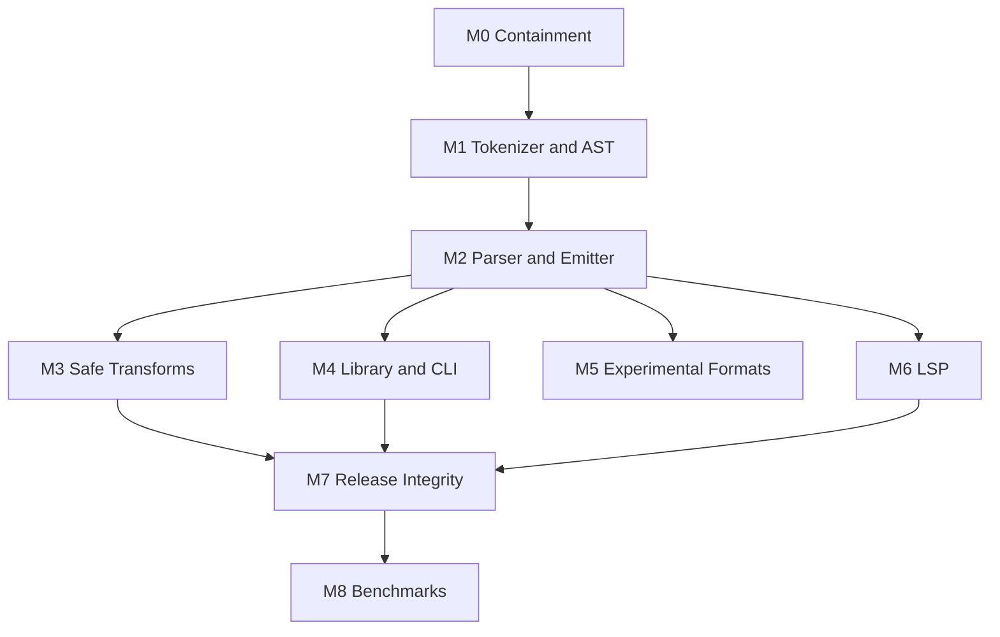

# ZigCSS Development Plan

Status: Proposed for approval  
Plan version: 1.0  
Prepared: 2026-07-11  
Primary target: a trustworthy, standards-oriented CSS compiler, minifier, Zig library, and CLI  
First target release: `0.4.0-alpha.1`

## 1. Purpose

This document turns the repository audit into an executable development program. It is the source of truth for stabilization, implementation order, validation, release gates, and future autonomous work.

The current repository is an ambitious prototype. It has useful scaffolding for parsing, optimization, preprocessors, a CLI, an LSP, documentation, packaging, and benchmarks, but the core parser and optimizer are not yet safe enough for production CSS. Development must therefore prioritize correctness and security before new features or performance work.

## 2. Executive decisions

The following decisions are defaults for the autonomous program. Changing one requires an Architecture Decision Record (ADR) and project-owner approval.

1. The stable product scope for `0.4.x` is standards-oriented CSS compilation, formatting, minification, a Zig library, and a CLI.
2. SCSS, SASS, LESS, Stylus, CSS-in-JS, PostCSS-like transforms, CSS Modules, and Tailwind-like `@apply` behavior remain experimental until each has its own compatibility contract and test suite.
3. Correctness takes priority over speed. A transformation is disabled unless semantic equivalence is demonstrated.
4. Parsing, transformation, and emission are separate stages. Code generation must not mutate or optimize the AST.
5. Unsupported syntax and unavailable functionality fail explicitly. The compiler must not silently delete, reinterpret, or ignore input.
6. Source spans are foundational. Source maps, diagnostics, error recovery, and LSP work do not proceed on the current span-less AST.
7. Public performance claims remain withdrawn until benchmarks validate equivalent output using reproducible methodology.
8. The public compile service remains disabled or strictly isolated until its security gates pass.

## 3. Autonomous execution contract

### 3.1 Required model

The project owner requires autonomous development to use **Codex 5.6 Sol Ultra exclusively**.

Execution rules:

- The exact model must be selected and verified in the Codex application before autonomous implementation begins.
- No fallback, downgrade, alternate model, or unverified subagent is permitted.
- If the required model is unavailable or cannot be verified, work pauses and reports `BLOCKED_MODEL_UNAVAILABLE`.
- The repository cannot technically enforce the selected application model. Model verification is an operator-level gate.
- Autonomous work must not delegate to agents whose model identity is not guaranteed to match this requirement.

### 3.2 Start gate

Autonomous implementation begins only when all of these are true:

- This plan is approved by the project owner.
- Codex 5.6 Sol Ultra is selected and verified.
- A dedicated branch is created from a clean, current `main` branch.
- Baseline commands and known failures are recorded in `DEVELOPMENT_STATUS.md`.
- The public compile endpoint is either disabled or explicitly accepted as the first security task.

Recommended branch: `vale/zigcss-recovery`.

### 3.3 Allowed autonomous actions

Once the start gate is satisfied, the autonomous run may:

- Edit source, tests, documentation, workflows, build files, and local development configuration in this repository.
- Add or update dependencies when required by an approved work package.
- Run local builds, tests, fuzzers, linters, formatters, package dry runs, and local container checks.
- Create focused commits after a work package passes its required gates.
- Update this plan, `DEVELOPMENT_STATUS.md`, the changelog, and capability documentation as implementation evidence changes.

The run may not, without separate explicit authorization:

- Publish npm, Homebrew, editor-extension, container, or GitHub releases.
- Push branches, create pull requests, merge to protected branches, or alter external infrastructure.
- Deploy the documentation or public compile service.
- Rotate secrets, change billing, or weaken security controls.
- Expand stable scope beyond this plan.

### 3.4 Work loop

For every work package, the autonomous executor follows this loop:

1. Read this plan, current status, relevant ADRs, and the affected implementation.
2. Reproduce the issue or establish a measurable baseline.
3. Add a failing regression or conformance test.
4. Implement the smallest architecture-consistent change.
5. Run focused tests.
6. Run milestone-required integration gates.
7. Inspect memory ownership, ordering, error behavior, and unsupported-input behavior.
8. Update documentation and status using verified facts only.
9. Commit one coherent change with its tests.
10. Continue to the next unblocked package in dependency order.

### 3.5 Stop conditions

Autonomous work pauses rather than guessing when:

- The required model cannot be verified.
- A requested action needs new external authority.
- A change would destroy or overwrite user-owned work.
- A scope decision would materially alter the product contract.
- A dependency license or supply-chain concern is unresolved.
- The same blocking condition persists after three evidence-gathering attempts.
- A security issue could be made worse by continuing without review.
- Tests reveal that an accepted architecture decision is invalid.

## 4. Product contract

### 4.1 Stable `0.4.x` scope

- CSS Syntax-compatible tokenization and parsing for the documented supported grammar.
- Lossless or semantically lossless parsing for supported CSS.
- Deterministic pretty printing.
- Semantics-preserving minification.
- Explicit, individually configurable optimizer passes.
- Accurate diagnostics with source spans.
- Source Map v3 output.
- A public Zig library API with clear ownership.
- A strict CLI with stdin/stdout, files, batch compilation, watch mode, and atomic writes.
- Target-aware vendor prefixing once compatibility behavior is verified.
- Reproducible builds and verified release artifacts.

### 4.2 Experimental scope

- SCSS/SASS subset processing.
- LESS and Stylus subset processing.
- CSS Modules transformations.
- CSS-in-JS extraction.
- PostCSS-inspired directives.
- Tailwind-inspired fixed `@apply` utilities.
- Tree shaking, dead-code elimination, and critical-CSS extraction.
- Native in-process plugins.

Experimental functionality must:

- Be explicitly enabled.
- Publish a compatibility matrix.
- Reject unsupported constructs when they could change output.
- Never be described as full ecosystem compatibility.
- Not block the stable core release unless imported into the stable pipeline.

### 4.3 Explicit non-goals for `0.4.0`

- Full Dart Sass compatibility.
- Full LESS or Stylus language compatibility.
- JavaScript PostCSS plugin execution inside the Zig binary.
- Full Tailwind configuration, scanning, plugin, variant, or arbitrary-value compatibility.
- A stable cross-language plugin ABI.
- Unproven global CSS custom-property evaluation.
- Automatic logical-to-physical property conversion.

## 5. Target architecture

The implementation should converge on this pipeline:

```text
SourceFile
  -> Tokenizer
  -> Lossless syntax/component-value representation
  -> Typed CSS AST
  -> Optional validated transform passes
  -> Emitter + source map builder
  -> CompileResult
```

Recommended module boundaries:

```text
src/lib.zig                    Public library root
src/cli.zig                    CLI adapter over the library
src/source.zig                 Source files, IDs, spans, line index
src/tokenizer.zig              CSS Syntax tokens
src/syntax/                    Component values and recoverable syntax tree
src/css/ast.zig                Typed transformation AST
src/css/parser.zig             CSS lowering/parser
src/css/selector_parser.zig    Selector grammar
src/css/value_parser.zig       Typed values used by safe transforms
src/diagnostics.zig            Structured diagnostics
src/transforms/                One module per transform pass
src/prefixing/                 Target queries and prefix rules
src/emit/                      Pretty/minified output and escaping
src/sourcemap.zig              Source Map v3 builder
src/formats/                   Explicit experimental adapters
src/lsp/                       JSON-RPC transport and language features
```

The exact filenames may change, but the boundaries are mandatory:

- The CLI does not own compilation logic.
- The emitter does not run transforms.
- The optimizer does not own parsing or output.
- Experimental format adapters do not bypass core diagnostics and ownership rules.
- LSP features consume the same tokenizer, syntax tree, spans, and diagnostics as compilation.

## 6. Work breakdown and milestone order

Effort estimates are planning ranges for one experienced engineer, not delivery promises.

## Milestone 0: Containment and regression baseline

Estimated effort: 4-7 engineer days  
Target: `0.3.x` security and truthfulness patch, if a patch release is authorized

### Work packages

| ID | Work package | Depends on |
|---|---|---|
| `SEC-001` | Prevent static-file path traversal and malformed-URL crashes | None |
| `SEC-002` | Add compile API body, time, output, process, concurrency, and cleanup limits | `SEC-001` |
| `SEC-003` | Run the docs container as a non-root user and minimize readable files | `SEC-001` |
| `SAFE-001` | Mark current compiler and format adapters experimental; correct public claims | None |
| `TEST-001` | Add regressions for every audit reproduction | None |
| `OPT-001` | Disable unsafe optimizer passes by default | `TEST-001` |
| `PROF-001` | Fix or temporarily disable the profiling double-end/double-free path | `TEST-001` |
| `CLI-001` | Reject input/output identity and multi-file output collisions | `TEST-001` |
| `CLI-002` | Reject unknown flags, missing values, and unavailable features | `TEST-001` |
| `CI-001` | Fix docs artifact path and enforce docs tests on pull requests | None |
| `CI-002` | Pass actual target triples to Zig and inspect artifact architectures | None |

### Required regression cases

- Compound versus descendant selectors.
- Functional pseudo-classes.
- Attribute selectors.
- Semicolons and braces inside strings/functions.
- Declaration-bearing at-rules.
- Percentage keyframes.
- Mandatory whitespace in at-rule emission.
- `!important` declaration ordering.
- Empty-rule and selector-removal ordering.
- Non-adjacent selector and at-rule merging.
- Custom-property cascade behavior.
- Logical properties under RTL and vertical modes.
- Background/font reset behavior.
- Typed math precedence and units.
- Selector simplification crash inputs.
- Profiling lifecycle.
- Source-map and browser-target flag behavior.
- Batch output collision and accidental overwrite behavior.
- Encoded path traversal and compile-service exhaustion limits.

### Exit criteria

- Public static file serving cannot escape its configured root.
- The public compiler endpoint is disabled or bounded by tested limits.
- No known CLI path overwrites an input.
- No accepted flag silently does nothing.
- Unsafe transforms are unreachable by default.
- Every known crash/corruption has a committed failing-then-passing regression or is explicitly disabled.
- Documentation describes actual current behavior.

## Milestone 1: Tokenizer, source model, and AST foundation

Estimated effort: 15-25 engineer days  
Target: internal architecture milestone

### Work packages

| ID | Work package | Depends on |
|---|---|---|
| `ARCH-001` | Define `SourceFile`, `SourceId`, `Span`, diagnostics, and compilation ownership | Milestone 0 |
| `TOK-001` | Implement CSS Syntax token kinds and tokenizer state machine | `ARCH-001` |
| `TOK-002` | Implement CSS escapes, Unicode identifiers, numbers, dimensions, percentages, URLs, and bad-token recovery | `TOK-001` |
| `TOK-003` | Track comments, whitespace, source ranges, and line indexing | `TOK-001` |
| `SYN-001` | Parse nested blocks, functions, and component values losslessly | `TOK-002`, `TOK-003` |
| `AST-001` | Introduce complex/compound/simple selector structures with explicit combinators | `SYN-001` |
| `AST-002` | Introduce declarations, component-value lists, and `!important` metadata | `SYN-001` |
| `AST-003` | Introduce at-rule block variants for declarations, rules, keyframes, raw values, and no block | `SYN-001` |
| `MEM-001` | Adopt compilation-scoped arena ownership with explicit result ownership | `ARCH-001` |
| `DIAG-001` | Produce structured recoverable tokenizer/syntax diagnostics | `TOK-003`, `SYN-001` |

### Tokenizer requirements

- Follow CSS Syntax tokenization behavior for supported tokens.
- Never index past input on truncated escape, comment, string, URL, or block input.
- Preserve enough raw spelling to re-emit unsupported or custom syntax safely.
- Track byte spans and derive accurate line/column data from a line index.
- Distinguish parse diagnostics from allocation and I/O failures.
- Support allocator-failure tests.

### AST requirements

- `.a.b` and `.a .b` must have structurally different ASTs.
- Functional pseudo-class arguments must remain structured or losslessly preserved.
- Attribute operators, values, quoting, namespace and case flags must be representable.
- At-rules must retain their prelude and correct block category.
- Declaration values must not be split by delimiters inside nested component values.
- All transformable nodes must retain useful source spans.

### Exit criteria

- A tokenizer/component-value corpus round-trips without crashes or leaks.
- Truncated input produces diagnostics rather than panics.
- Source positions are correct for LF, CRLF, Unicode, and multi-byte input.
- AST invariants are tested independently of the CLI.
- The old parser can coexist behind a temporary feature boundary until Milestone 2 replaces it.

## Milestone 2: Standards-correct CSS parser and emitter

Estimated effort: 20-30 engineer days  
Target: `0.4.0-alpha.1`

### Work packages

| ID | Work package | Depends on |
|---|---|---|
| `PAR-001` | Parse selector lists, compounds, combinators, attributes, and functional pseudos | Milestone 1 |
| `PAR-002` | Parse declarations and nested component values | Milestone 1 |
| `PAR-003` | Parse qualified rules and classify at-rule block content | `PAR-001`, `PAR-002` |
| `PAR-004` | Parse keyframes, media, supports, container, layer, property, page, and font-face structures | `PAR-003` |
| `ERR-001` | Implement recoverable error boundaries and diagnostic synchronization | `PAR-003` |
| `EMIT-001` | Implement deterministic pretty emission and CSS escaping | `PAR-001`-`PAR-004` |
| `EMIT-002` | Implement grammar-aware whitespace minification | `EMIT-001` |
| `ROUND-001` | Build parse/emit/parse equivalence tests | `EMIT-001` |
| `MAP-001` | Generate Source Map v3 mappings from source spans | `EMIT-001` |
| `NEST-001` | Implement native CSS nesting only after its dedicated grammar suite passes | `PAR-003` |

### Emitter safety rules

- Preserve token boundaries; minification may not merge tokens into different grammar.
- Preserve strings, escapes, comments that affect token separation, and custom syntax.
- Preserve declaration and rule order.
- Preserve fallback declarations and importance.
- Use explicit formatting modes; pretty printing and minification share escaping logic.
- Never invoke optimizer passes.

### Test strategy

- Unit tests for tokenizer, selector parser, declaration parser, at-rule parser, and emitter.
- Golden input/output fixtures.
- Parse-emit-parse structural equivalence.
- Differential checks against an independent standards-oriented CSS parser/minifier.
- Browser computed-style fixtures for cascade-sensitive cases.
- Negative tests for malformed and truncated input.
- Deep-nesting limits and stack-exhaustion protection.

### Exit criteria

- All audit parser and minifier regressions pass.
- The supported grammar has a published compatibility matrix.
- Pretty and minified output parse successfully in the independent validation parser.
- Source maps resolve representative generated positions to the correct source spans.
- The stable CLI path uses the new parser and emitter.
- Legacy parsing is removed from the stable path.

## Milestone 3: Semantics-preserving transform pipeline

Estimated effort: 20-35 engineer days  
Target: `0.4.0-beta.1`

### Work packages

| ID | Work package | Depends on |
|---|---|---|
| `PASS-001` | Create pass manager, pass metadata, ordering, safety class, and validation hooks | Milestone 2 |
| `OPT-010` | Stable empty-rule/comment cleanup with order preservation | `PASS-001` |
| `OPT-011` | Duplicate-declaration analysis respecting importance and fallback chains | `PASS-001` |
| `OPT-012` | Typed color and zero-value shortening where provably shorter and equivalent | `VAL-001` |
| `OPT-013` | Shorthand synthesis with reset, importance, ordering, and compatibility analysis | `VAL-001`, `OPT-011` |
| `OPT-014` | Adjacent-only selector/rule merge with cascade proof | `PASS-001` |
| `OPT-015` | Adjacent-only at-rule merge with layer/query ordering proof | `PASS-001` |
| `VAL-001` | Typed numeric values, units, dimensional compatibility, and precedence | Milestone 2 |
| `MATH-001` | Safe `calc()`, `min()`, `max()`, and `clamp()` folding | `VAL-001` |
| `CUSTOM-001` | Preserve custom properties by default; isolate any explicit static-resolution mode | `PASS-001` |
| `LOGICAL-001` | Remove default logical-to-physical conversion; define explicit target semantics if retained | `PASS-001` |
| `PREFIX-001` | Define target query grammar and generated compatibility data | Milestone 2 |
| `PREFIX-002` | Implement property, value, selector, and at-rule prefix rules with correct ordering | `PREFIX-001` |
| `TREE-001` | Move dead-code and critical-CSS extraction into conservative explicit modes | `PASS-001` |

### Pass acceptance template

Every pass must include:

- A documented precondition and postcondition.
- Cases where the pass intentionally does nothing.
- Exact regression fixtures for importance, fallbacks, custom properties, layers, media queries, logical directions, and unsupported values.
- Idempotence: running the pass twice produces identical output.
- Order preservation unless a formal equivalence rule permits movement.
- Memory and OOM tests.
- Differential or computed-style validation for representative transformations.
- A size check when the pass claims minification benefit.

### Exit criteria

- `--optimize` enables only passes that satisfy the acceptance template.
- No transform depends on `swapRemove` where source order affects semantics.
- All transforms recurse safely through supported nested rule structures.
- Browser targets materially and predictably change prefix output.
- Invalid or unknown target queries fail with diagnostics.
- Optimized output passes parse equivalence and cascade regression suites.

## Milestone 4: Public library, CLI, build integration, and profiling

Estimated effort: 10-15 engineer days  
Target: `0.4.0-beta.2`

### Work packages

| ID | Work package | Depends on |
|---|---|---|
| `API-001` | Add `src/lib.zig` and public module exports | Milestone 2 |
| `API-002` | Add `CompileOptions`, `CompileResult`, structured diagnostics, dependencies, and `deinit` | `API-001` |
| `API-003` | Define plugin ordering, ownership, failure behavior, and stability status | `API-002`, `PASS-001` |
| `BUILD-001` | Add `build.zig.zon` with compatible Zig version metadata | `API-001` |
| `BUILD-002` | Rewrite build helpers using supported Zig build APIs and declared inputs/outputs | `BUILD-001` |
| `BUILD-003` | Make all build examples compile in CI | `BUILD-002` |
| `CLI-010` | Make the executable a thin library client | `API-002` |
| `CLI-011` | Add strict parsing, `--version`, `--syntax`, stdin/stdout, and useful exit codes | `CLI-010` |
| `CLI-012` | Add atomic output, parent creation, collision detection, and deterministic batch naming | `CLI-010` |
| `WATCH-001` | Track source and imported dependencies; avoid double reads and unchanged-error loops | `CLI-012` |
| `PARALLEL-001` | Add bounded worker queue, cancellation, independent ownership, and deterministic writes | `CLI-012` |
| `PROF-010` | Implement accurate single-end timing and allocator-backed memory metrics | `API-002` |

### Public API shape

The final names may evolve, but the contract must expose equivalent concepts:

```zig
pub const CompileOptions = struct {
    syntax: Syntax = .css,
    format: OutputFormat = .pretty,
    source_map: SourceMapOptions = .none,
    transforms: TransformOptions = .{},
    targets: ?TargetQuery = null,
};

pub const CompileResult = struct {
    css: []const u8,
    source_map: ?[]const u8,
    diagnostics: []const Diagnostic,
    dependencies: []const Dependency,
    module_exports: ?ModuleExports,

    pub fn deinit(self: *CompileResult, allocator: std.mem.Allocator) void;
};
```

### Exit criteria

- README and docs API examples compile in CI.
- `zig build`, `zig build test`, build helpers, and consumer examples pass with the documented Zig version.
- CLI integration tests cover every option, error, format selection, output mode, batch path, and signal path.
- Profiling completes without leaks and measures the actual stages.
- Single and parallel compilation produce deterministic identical results.

## Milestone 5: Experimental format strategy

Estimated effort: separate per-format estimates; not on the core `0.4.0` critical path

### Required ADR

Before further preprocessor work, create `ADR-005-preprocessor-strategy.md` and choose one approach per language:

1. A clearly named, limited native subset with strict unsupported-syntax errors.
2. Integration with the canonical external implementation.
3. Removal until a dedicated implementation program is funded.

### Work packages

| ID | Work package | Depends on |
|---|---|---|
| `FMT-001` | Publish syntax and compatibility matrix for every adapter | Milestone 2 |
| `SCSS-001` | Decide native subset versus canonical Sass integration | `FMT-001` |
| `SCSS-002` | Add lexical scope, module/import behavior, strings/comments, arithmetic, and strict errors for chosen scope | `SCSS-001` |
| `LESS-001` | Define and test supported LESS subset or integration | `FMT-001` |
| `STYLUS-001` | Define and test supported Stylus subset or integration | `FMT-001` |
| `MODULE-001` | Produce CSS Modules export mappings and file-specific deterministic names | `API-002` |
| `MODULE-002` | Add `:local`, `:global`, composition, value, and dependency behavior for chosen scope | `MODULE-001` |
| `JS-001` | Replace byte scanning with an actual JS/TS parser integration or remove stable CSS-in-JS claims | `FMT-001` |
| `POSTCSS-001` | Rename fixed transforms or integrate a real JavaScript plugin host | `FMT-001` |
| `TAILWIND-001` | Rename the fixed utility preset or integrate canonical Tailwind behavior | `FMT-001` |

### Exit criteria for any experimental adapter

- Unsupported constructs are diagnosed rather than deleted.
- String and comment handling cannot corrupt URLs or quoted text.
- The adapter has fixture, negative, differential, and dependency tests.
- Generated CSS passes the stable CSS parser and emitter.
- Documentation states exact supported semantics.
- Only adapters with canonical-suite-level evidence can graduate from experimental.

## Milestone 6: LSP and editor integrations

Estimated effort: 10-20 engineer days  
Target: after `0.4.0-beta.1`

### Work packages

| ID | Work package | Depends on |
|---|---|---|
| `LSP-001` | Implement dynamic Content-Length framing and protocol lifecycle | Milestone 2 |
| `LSP-002` | Use standards-compliant JSON serialization and error responses | `LSP-001` |
| `LSP-003` | Implement open/change/close, shutdown, exit, cancellation, and version handling | `LSP-001` |
| `LSP-004` | Convert byte spans to UTF-16 LSP positions | `ARCH-001`, `LSP-001` |
| `LSP-005` | Implement diagnostics from recoverable compiler diagnostics | `DIAG-001`, `LSP-003` |
| `LSP-006` | Add completion, hover, symbols, definition, references, and rename from syntax/workspace indexes | `LSP-004`, `LSP-005` |
| `LSP-007` | Add protocol transcript, large document, Unicode, malformed request, and leak tests | `LSP-001`-`LSP-006` |
| `VSCODE-001` | Add lockfile, compile/test workflow, packaging, version synchronization, and binary discovery | `LSP-007` |
| `NEOVIM-001` | Validate documented configuration against the final server command and capabilities | `LSP-007` |

### Exit criteria

- The server passes protocol transcript tests for requests and notifications.
- Large documents are not limited to 8 KiB.
- UTF-16 positions are correct for non-ASCII text.
- Advertised capabilities exactly match implemented behavior.
- Workspace navigation is syntax-aware rather than unrestricted textual replacement.
- Editor extensions compile and pass integration smoke tests in CI.

## Milestone 7: Documentation, packaging, and release integrity

Estimated effort: 10-15 engineer days  
Target: `0.4.0-rc.2`

### Work packages

| ID | Work package | Depends on |
|---|---|---|
| `DOC-001` | Generate capability/status tables from tested feature metadata | Milestones 2-4 |
| `DOC-002` | Compile and test all code examples and internal links | `DOC-001` |
| `DOC-003` | Add end-to-end playground API tests and accurate status/error UI | `SEC-002`, Milestone 2 |
| `WEB-001` | Add response headers, caching, request limits, worker isolation, health checks, and non-root runtime | `SEC-001`-`SEC-003` |
| `DEP-001` | Resolve high/critical production dependency advisories and add update automation | None |
| `REL-001` | Synchronize versions across Zig, npm, Docker, editor extension, formula, docs, and changelog | Milestone 4 |
| `REL-002` | Generate SHA-256 manifests, SBOMs, signatures, and provenance | `REL-001` |
| `REL-003` | Verify release assets in npm installer, Docker, and Homebrew paths | `REL-002` |
| `REL-004` | Scope workflow permissions per job and pin external actions | None |
| `REL-005` | Smoke-test every native artifact and npm installation path | `REL-003` |

### Exit criteria

- Documentation contains no untested feature or performance claim.
- All internal links and examples pass CI.
- The docs site deploys the actual Vite artifact.
- Production dependency audit reports no high or critical production findings.
- Every release archive has verified architecture, checksum, SBOM, signature/provenance, and installation smoke evidence.
- The Homebrew formula contains the current version and a valid hash.
- No release job publishes unless the full release validation workflow succeeds.

## Milestone 8: Credible benchmark and performance program

Estimated effort: 5-10 engineer days  
Target: after correctness release gates are green

### Work packages

| ID | Work package | Depends on |
|---|---|---|
| `BENCH-001` | Create deterministic versioned corpora with recorded byte/rule complexity | Milestone 2 |
| `BENCH-002` | Pin and preinstall competitor binaries; avoid `npx` startup distortion | `BENCH-001` |
| `BENCH-003` | Validate output before accepting a timing sample | `BENCH-001` |
| `BENCH-004` | Separate cold CLI, warm CLI, in-process API, memory, and throughput benchmarks | `API-002` |
| `BENCH-005` | Report median, p95, variance, environment, and raw samples | `BENCH-004` |
| `BENCH-006` | Run scheduled benchmarks on controlled hardware and archive artifacts | `BENCH-005` |
| `BENCH-007` | Generate published reports from archived benchmark data | `BENCH-006` |

### Exit criteria

- Inputs are deterministic and their actual sizes are reported.
- Every timed output passes semantic or structural validation.
- Failures cannot silently disappear from averages.
- Competitors and ZigCSS are invoked through comparable execution modes.
- Public claims are generated from archived results rather than manually copied.
- Performance regression gates use statistically meaningful thresholds.

## 7. Dependency graph



Parallel work is allowed only where the graph permits it. In particular:

- Security containment and CI repairs may proceed immediately.
- Library API scaffolding may begin during parser work, but its stable types wait for ownership and diagnostic decisions.
- LSP feature work waits for source spans and recoverable parsing.
- Optimizer work waits for a correct AST and emitter.
- Benchmark claims wait for correctness and release integrity.

## 8. Test and validation architecture

Recommended test layout:

```text
tests/unit/tokenizer/
tests/unit/parser/
tests/unit/emitter/
tests/unit/transforms/
tests/fixtures/css-syntax/
tests/fixtures/selectors/
tests/fixtures/at-rules/
tests/fixtures/source-maps/
tests/regressions/
tests/differential/
tests/cli/
tests/build-integration/
tests/lsp/
tests/security/
tests/fuzz-seeds/
```

### Pull request gates

- `zig fmt --check`.
- Unit and integration tests in Debug and ReleaseSafe.
- Exact parser/emitter regressions.
- Docs tests and Vite build.
- Editor extension compile/tests.
- npm package dry run and local install smoke.
- JavaScript/TypeScript lint and type checking.
- Production dependency audit.
- No dirty generated artifacts.

### Nightly gates

- Fuzz tokenizer, component values, parser, format detection, LSP JSON, and compile API input.
- Run allocator-failure and leak checks.
- Run deep nesting and resource-limit tests.
- Cross-compile all supported targets and inspect architectures.
- Run differential corpus validation.
- Build and security-test containers.

### Release gates

- All pull request and nightly gates green on the release commit.
- Native artifact smoke tests on executable platforms.
- Source-map consumer validation.
- Reproducibility comparison where supported.
- Checksums, SBOM, signatures/provenance.
- npm, Docker, and Homebrew installation smoke tests.
- Documentation capability matrix generated from the release commit.
- No unresolved P0 or P1 correctness/security issue.

## 9. Status tracking

At autonomous start, create `DEVELOPMENT_STATUS.md` with:

- Current branch and base commit.
- Verified execution model.
- Current milestone and work package.
- Baseline commands and results.
- Completed work packages with commit IDs.
- Active blockers.
- Known regressions.
- Next eligible work package.
- Last full validation result.

Status values:

- `NOT_STARTED`
- `IN_PROGRESS`
- `BLOCKED`
- `IMPLEMENTED`
- `VERIFIED`
- `DEFERRED`

A package becomes `VERIFIED` only after its focused tests and milestone gates pass.

## 10. Commit and branch policy

- Use the `vale/` branch prefix.
- Keep one coherent work package per commit where practical.
- Commit tests with the implementation they validate.
- Do not mix formatting-only rewrites with semantic changes.
- Never rewrite or discard user-owned changes.
- Do not push, publish, merge, or deploy without explicit external authorization.
- Recommended commit form: `<type>(<area>): <verified outcome>`.
- Include the work-package ID in the commit body.

Examples:

```text
fix(server): contain decoded static paths

Work-Package: SEC-001
```

```text
feat(tokenizer): preserve strings and escaped identifiers

Work-Package: TOK-002
```

## 11. Risk register

| Risk | Impact | Mitigation |
|---|---|---|
| Continuing to patch the current byte parser | Repeated corruption and architectural debt | Replace it through Milestones 1-2 rather than extending it |
| Optimizer scope explosion | Long delays and unsafe releases | Enable one proven pass at a time |
| Preprocessor parity claims | Multi-quarter scope hidden as minor features | Keep adapters experimental and require an ADR per language |
| Source-map accuracy after transforms | Incorrect debugging information | Preserve spans and define generated-node mapping policies before transforms |
| Public untrusted compilation | Remote denial of service or information exposure | Disable initially; later use strict limits, isolation, and security tests |
| Compatibility data becoming stale | Incorrect prefixing | Generate versioned tables and record their source/version |
| Cross-compilation mislabeled as native | Broken release assets | Inspect architectures and smoke-test artifacts |
| Benchmark marketing pressure | Speed prioritized over semantics | Reject timing samples until output validation succeeds |
| Model availability | Autonomous run violates owner requirement | Hard stop when Codex 5.6 Sol Ultra cannot be verified |
| Large migration destabilizes all surfaces | CLI, LSP, docs, and formats break together | Maintain explicit compatibility boundaries and milestone gates |

## 12. ADR backlog

The following decisions should be captured under `docs/adr/` during implementation:

- `ADR-001-core-product-scope.md`
- `ADR-002-tokenizer-and-syntax-tree.md`
- `ADR-003-memory-and-result-ownership.md`
- `ADR-004-transform-safety-classes.md`
- `ADR-005-preprocessor-strategy.md`
- `ADR-006-browser-target-query-language.md`
- `ADR-007-source-map-policy-for-generated-nodes.md`
- `ADR-008-lsp-workspace-index.md`
- `ADR-009-release-signing-and-provenance.md`
- `ADR-010-autonomous-model-requirement.md`

## 13. Release roadmap

### `0.3.x`

- Security containment.
- Documentation truthfulness.
- Destructive CLI and crash prevention.
- No new production-readiness claim.

### `0.4.0-alpha.1`

- New tokenizer, source model, AST, CSS parser, and safe emitter.
- Stable path excludes unsafe optimizer behavior.
- Known parser/minifier regressions fixed.

### `0.4.0-beta.1`

- Safe transform manager and first verified optimization passes.
- Target-aware prefixing or prefixing remains disabled.
- Source maps validated.

### `0.4.0-beta.2`

- Public Zig API.
- Strict CLI.
- Working package manifest, build helpers, examples, watch mode, parallel compilation, and profiler.

### `0.4.0-rc.2`

- LSP/editor validation.
- Documentation and packaging synchronized.
- Verified artifacts, checksums, SBOM, signatures/provenance.
- Public compile service remains disabled unless every security gate passes.

### `0.4.0`

- Production-ready core CSS compiler.
- Experimental adapters clearly separated.
- No unresolved P0/P1 correctness or security issue.

### `1.0.0`

- Stable public API and compatibility policy.
- Published conformance threshold met.
- Sustained fuzzing and memory gates clean.
- Verified cross-platform release process.
- Performance claims backed by archived, correctness-equivalent results.

## 14. Definition of done for the autonomous program

The autonomous recovery program is complete when:

- The stable parser/emitter no longer reproduces any known audit corruption.
- Supported CSS syntax has a published, tested compatibility matrix.
- Stable transforms are semantics-preserving under the project validation strategy.
- Source maps and diagnostics use accurate spans.
- The public Zig API and CLI match their documentation.
- Build integration and examples compile with the supported Zig version.
- LSP protocol behavior and editor packages pass integration tests.
- Public web surfaces pass traversal, resource-limit, process-isolation, and dependency-security gates.
- Every release artifact is correctly targeted, verified, and installable.
- Documentation contains no untested feature or performance claim.
- Benchmarks validate output before timing and are reproducible.
- The repository passes formatting, Debug, ReleaseSafe, differential, fuzz, leak, docs, packaging, and release gates.
- No P0 or P1 issue remains open for the stable scope.

## 15. First autonomous sequence

After plan approval and model verification, the autonomous run starts with this exact sequence:

1. Create `vale/zigcss-recovery` and `DEVELOPMENT_STATUS.md`.
2. Record the baseline test, formatting, docs, package, and known-reproduction results.
3. Implement `SEC-001` and its security regression tests.
4. Disable the public compile API pending `SEC-002`, unless isolation is implemented immediately.
5. Implement `TEST-001` without changing compiler behavior beyond required harness support.
6. Implement `OPT-001`, `PROF-001`, `CLI-001`, and `CLI-002` in that order.
7. Implement `CI-001` and `CI-002`.
8. Complete Milestone 0 validation and record the result.
9. Create the source/ownership ADRs.
10. Begin `ARCH-001` and `TOK-001`.

No feature work outside this sequence is eligible until Milestone 0 is verified.
